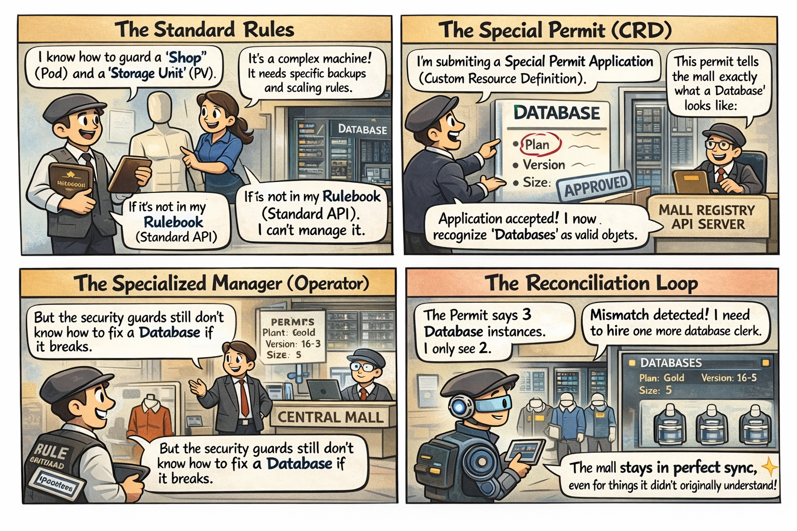

# 🎭 The Manager with the Manual

This comic explains:
- **CRDs**: The "Special Permit" that teaches the mall new rules.
- **Custom Resources**: The actual implementation of those rules.
- **Operators**: The specialized "Managers" who know how to handle specific permits.

📌 Read this if:
- You are working on **[LAB 04](/labs/architecture/lab04-crds-operators/README.md)**.
- You want to understand why Kubernetes doesn't know what a "Database" is by default.
- You want to understand the **Reconciliation Loop** (Observe → Analyze → Act).

🔗 References:
- Docs → [Understanding CRDs](../../../docs/md-resources/understanding-custom-resource-definitions-crds.md)
- Lab → [`labs/architecture/lab04-crds-operators`](../../../labs/architecture/lab04-crds-operators/README.md)

---

# 📖 Comic Script (Text Version)

*> **Scene 1:** In the Central Mall, a new high-tech server farm wants to open. The standard mall security is confused.*

---

### Frame 1: The Standard Rules
**Security Guard (K8s Node):** "I know how to guard a 'Shop' (Pod) and a 'Storage Unit' (PV). But what is this 'Database' thing?"
**Owner:** "It's a complex machine! It needs specific backups and scaling rules."
**Security Guard:** "If it's not in my **Rulebook** (Standard API), I can't manage it."

---

### Frame 2: The Special Permit (CRD)
**Owner:** "I'm submitting a **Special Permit Application** (Custom Resource Definition)."
**Owner:** "This permit tells the mall exactly what a 'Database' looks like: it has a 'Plan', a 'Version', and a 'Size'."
**Mall Registry (API Server):** "Application accepted! I now recognize 'Databases' as valid objects in this mall."

---

### Frame 3: The Specialized Manager (Operator)
**Owner:** "But the security guards still don't know how to fix a Database if it breaks."
**Operator:** "Allow me. I am a **Specialized Manager**. I've read the Database manual."
**Operator:** "I will watch your Permits (Custom Resources) 24/7. This is the **Operator Pattern**."

---

### Frame 4: The Reconciliation Loop
**Operator (Observing):** "The Permit says 3 Database instances. I only see 2."
**Operator (Analyzing):** "Mismatch detected! I need to hire one more database clerk."
**Operator (Acting):** "Deploying 1 new Database Pod now."
**Result:** "The mall stays in perfect sync, even for things it didn't originally understand!" 🤖✨

---

> **Key Takeaway:**
> - **CRD**: Defining the new object type (The manual entry).
> - **CR**: Creating an instance of that object (The actual permit).
> - **Operator**: The software that watches the CR and ensures the real state matches your goal.
