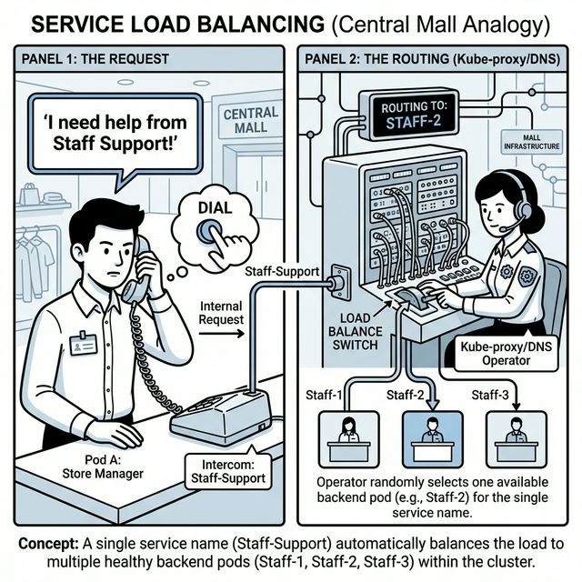

# 🎭 The Internal Intercom

This comic explains how **ClusterIP** (Internal Services) works in Kubernetes using the Central Mall's intercom analogy.

📌 Read this if:
- You are working on **CHAPTER 11 (Finding the Stores)**.
- You want to understand Service load balancing.
- You want to see how one stable name (`Staff-Support`) connects to many different workers.

🔗 References:
- 📖 **Docs:** [Service IP Trackers & Evolution](../../../docs/md-resources/service-ip-tracker-evolution.md)
- 🧪 **Lab:** [LAB 01 – ClusterIP & Internal Communication](../../../labs/services-and-networking/lab01-clusterip-internal-traffic/README.md)

---

# 📖 Comic Script (Text Version)

### Panel 1: The Request
**Store Manager (Pod A):** "I need help from Staff Support!"
**Narrator:** A store manager picks up an internal intercom handset and dials 'Staff-Support'. 
- **The Service Name:** `Staff-Support` is the stable name everyone dials.
- **The Caller:** Pod A making an internal request.

### Panel 2: The Routing
**Kube-proxy/DNS Operator:** "Routing to: STAFF-2"
**Narrator:** A central switchboard operator (Kube-proxy/DNS) receives the request for 'Staff-Support'. They see three available backend workers (Staff-1, Staff-2, Staff-3) and randomly select one to connect the call.
- **The Switchboard:** Kubernetes infrastructure managing the connection.
- **The Endpoints:** The healthy backend Pods currently available.

---

> **Key Takeaway:**
> A **ClusterIP Service** is like an internal intercom. It gives a group of workers a single, stable name and IP. You don't need to know who is working today; you just dial the intercom, and Kubernetes connects you to whoever is available.
