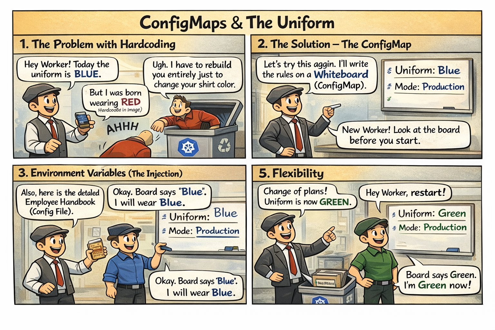

# 📋 The Rulebook & The Uniform

This comic explains:
- How to **decouple configuration** from container images
- How **ConfigMaps** work as a central "Whiteboard"
- How to inject config via **Env Vars** and **Volumes**

📌 Read this if:
- You are working on **LAB 01 (Configuration)**
- You want to understand **ConfigMaps & Decoupling**
- You want a quick **mental model** using the mall analogy 😄

🔗 References:
- Docs → [`docs/md-resources/core-concepts-configmaps-secrets-and-security.md`](../../../docs/md-resources/core-concepts-configmaps-secrets-and-security.md)
- Lab → [`labs/configuration/lab01-configmaps`](../../../labs/configuration/lab01-configmaps/README.md)

---

# 📖 Comic Script (Text Version)

*> **Scene 1:** Hardcoding rules into an employee's brain is a bad idea.*
*> What if the rules change? You'd have to fire the employee and hire a new one!*

---

### Frame 1: The Problem with Hardcoding
**Manager (K8s):** "Hey Worker! Today the uniform is **BLUE**."
**Worker (Pod):** "But I was born wearing **RED** (Hardcoded in Image)!"
**Manager:** "Ugh. I have to rebuild you entirely just to change your shirt color."
*(Manager throws the worker into a recycling bin)* 🗑️

---

### Frame 2: The Solution - The ConfigMap
**Manager:** "Let's try this again. I’ll write the rules on a **Whiteboard (ConfigMap)**."
**Whiteboard:** `Uniform: Blue`, `Mode: Production`

---

### Frame 3: Environment Variables (The Injection)
**Manager:** "New Worker! Look at the board before you start."
**Worker:** "Okay. Board says 'Blue'. I will wear Blue."
*(Worker puts on a blue shirt dynamically)* 👕

---

### Frame 4: Volume Mount (The Manual)
**Manager:** "Also, here is the detailed **Employee Handbook (Config File)**."
**Worker:** "Where do I put it?"
**Manager:** "In your pocket (`/etc/config`)."
*(Worker takes the file and puts it in their pocket)*

---

### Frame 5: Flexibility
**Manager:** "Change of plans! Uniform is now **GREEN**."
*(Manager updates the Whiteboard)*
**Manager:** "Hey Worker, restart!"
**Worker (New Instance):** "Board says Green. I’m Green now!"
*(Manager smiles)* "So much easier than rebuilding the whole person."

> **Key Takeaway:**
> - **ConfigMap**: Decouples configuration from the code.
> - **Env Vars**: Simple values (strings, numbers).
> - **Volume**: Complex config files (JSON, XML, properties).

---

## 🔗 References
- Chapter → [Chapter 5: Configuration](../../../sources/study-guide/ch05-configuration.md)
