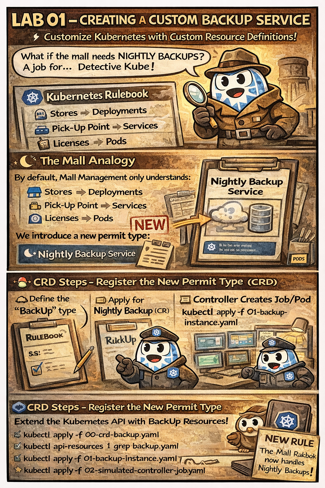

# 🗂️ The Nightly Backup Permit

This comic explains:

- what a **Custom Resource Definition (CRD)** really is
- why creating a **Custom Resource (CR)** does nothing by itself
- who turns intent into action (**Controllers / Operators**)
- how the **Reconciliation Loop** works

---

## 🛍️ Mall Analogy

The mall normally understands:

- Stores → Deployments
- Pick-up Points → Services
- Licenses → Pods

We introduce a new permit:

👉 **Nightly Backup Service**

- CRD → new rule in the rulebook  
- CR → filled request form  
- Controller → staff that actually runs the backup

---

## 🧠 Key Takeaways

- CRDs extend the Kubernetes API
- CRs only store **desired state**
- Controllers reconcile desired vs actual state
- Without a Controller, nothing happens

---

## 🔗 References
- Lab → [LAB 01 – Custom Backup Service (CRD)](../../../labs/extending-k8s/lab01-crd-custom-backup-service/README.md)
