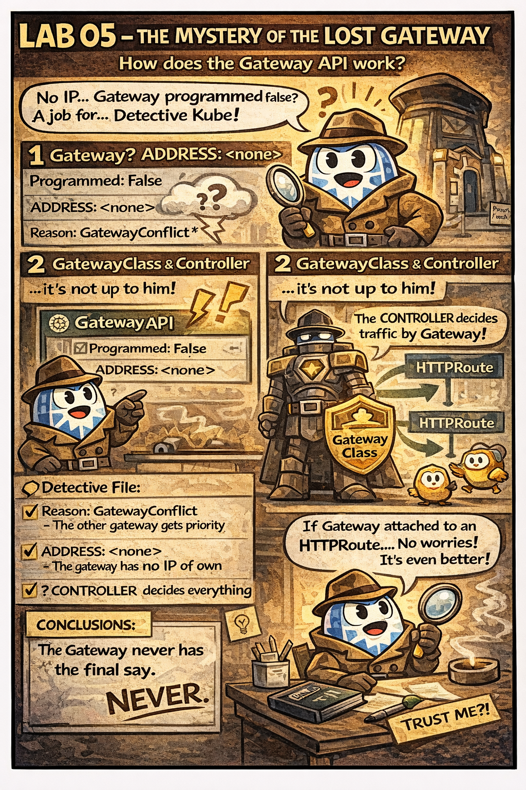

# 🕵️ The Mystery of the Lost Gateway

This comic explains:

- why a Gateway may show `Programmed: False`
- what **GatewayConflict** really means
- why a Gateway **does not have its own IP**
- who actually controls traffic (GatewayClass / Controller)

📌 Read this if:
- you are working on **LAB 05**
- you see `ADDRESS: <none>` and think something is broken
- you are under CKAD exam pressure 😄

🔗 References:
- Docs → [gateway-api.md](../../../docs/md-resources/gateway-api.md)
- Lab → [LAB 05 – Canary Deployments](../../../labs/deploying/lab05-canary-deployment-gateway-api/README.md)