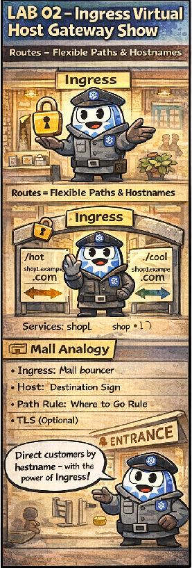

# 🕵️ The Virtual Host Gateway Show

This comic explains:

- How Ingress routes traffic to different hosts
- Path-based and host-based routing rules
- How Kubernetes decouples routing from services

📌 Read this if:
- You are doing **LAB 02**
- You want a clear visual of traffic routing via Ingress
- You like mall analogies for CKAD concepts

🔗 References:
- Docs → `docs/md-resources/lab02-ingress-routing.md`
- Lab → `labs/services-and-networking/lab02-ingress-virtual-host`
