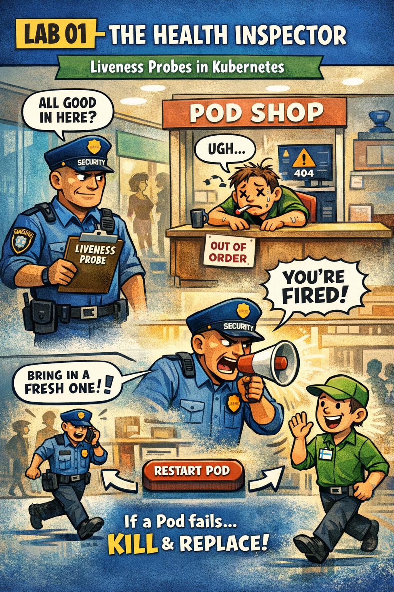

# 👁️ The Health Inspector

This comic explains:

- **Liveness Probes** vs Readiness Probes
- How Kubernetes decides when to **restart** a Pod
- The "Security Guard" analogy for health checks

📌 Read this if:
- you are doing **LAB 01 - Observability**
- you confuse "restart" with "remove from traffic"
- you want to understand self-healing apps

---

## 🛍️ Mall Analogy

- **Liveness Probe** → Security Guard inspecting the worker
- **Restart** → Replacing the worker with a fresh one
- **Readiness Probe** → Checking if the shop is open for customers

---

## 🧠 Key Takeaways

- Liveness failures kill the Pod
- Failing probes = restarts
- `initialDelaySeconds` prevents killing apps during startup

---

## 🔗 References
- Lab → [LAB 01 – Liveness Probes](../../../labs/observability/lab01-liveness-probes-health-inspector/README.md)
