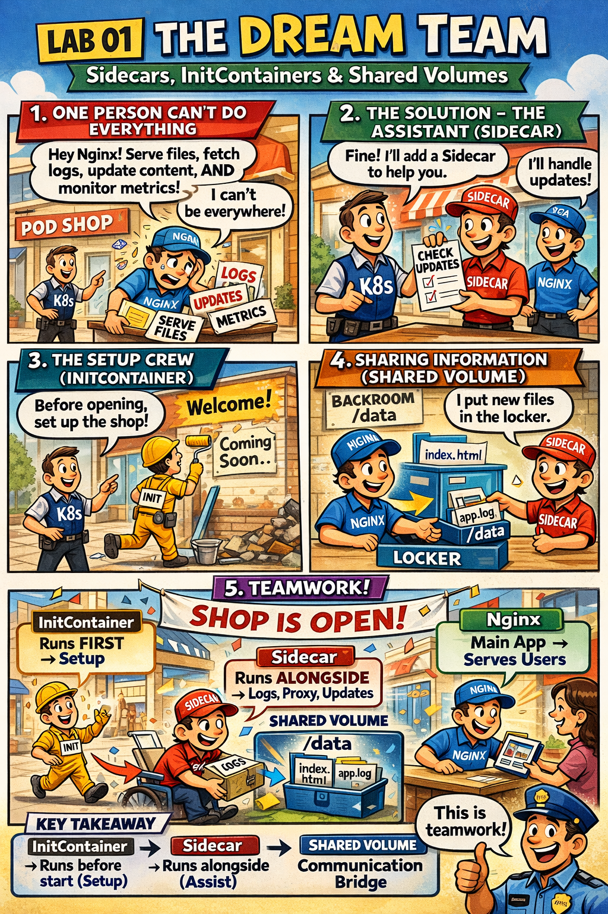

# 🤝 The Assistant & The Shared Space

This comic explains:
- How **Multi-Container Pods** work
- The role of **Sidecar** and **InitContainers**
- How containers share data using a **Volume**

📌 Read this if:
- You are working on **LAB 01 (Pod Design)**
- You want to understand **Pod patterns & Shared Volumes**
- You want a quick **mental model** using the mall analogy 😄

🔗 References:
- Docs → [`docs/md-resources/decoupling-pods.md`](../../../docs/md-resources/decoupling-pods.md)
- Lab → [`labs/pod-design/lab01-sidecar-pattern`](../../../labs/pod-design/lab01-sidecar-pattern/README.md)

---

# 📖 Comic Script (Text Version)

*> **Scene 1:** One person can’t do everything. Sometimes even a great Pod needs a helper.*

---

### Frame 1: The Problem with One Container
**Manager (K8s):** "Hey Nginx! Your job is to serve files."
**Worker 1 (Nginx):** "Okay!"
**Manager:** "Oh, and also fetch logs, update the website content, and monitor metrics."
**Worker 1:** "Wait... I only know how to serve files! I can't be everywhere at once!"
*(Worker looks overwhelmed)* 🤯

---

### Frame 2: The Solution - The Assistant (Sidecar)
**Manager:** "Fine. I’ll send you an **Assistant (Sidecar Container)**."
**Worker 2 (Sidecar):** "Hi! I’m highly specialized. I just check for updates."
**Worker 1:** "Great! I'll focus on customers."

---

### Frame 3: The Setup Crew (InitContainer)
**Manager:** "Wait! Before the store opens, we need to paint the walls."
**Worker 3 (InitContainer):** "I’m the renovation crew. I work **first**. When I’m done, I leave, and then you guys can start."
*(InitContainer paints 'Welcome' on the wall and disappears.)* 🎨

---

### Frame 4: Sharing Information (Shared Volume)
**Worker 1 (Nginx):** "How do we talk?"
**Worker 2 (Sidecar):** "We share a **Locker (Volume)** in the backroom."
**Worker 2:** "I put new files in the locker."
**Worker 1:** "And I take them out and show them to customers!"

*(Worker 2 puts a file in a box labeled `/data`)*
*(Worker 1 takes the same file out of the same box)*

---

### Frame 5: Teamwork
**Manager:** "This is efficient! Separate roles, shared goal."

> **Key Takeaway:**
> - **InitContainer**: Runs **before** the main app starts. Good for setup.
> - **Sidecar**: Runs **alongside** the main app. Good for logging/proxying.
> - **Shared Volume**: The bridge for communication.
