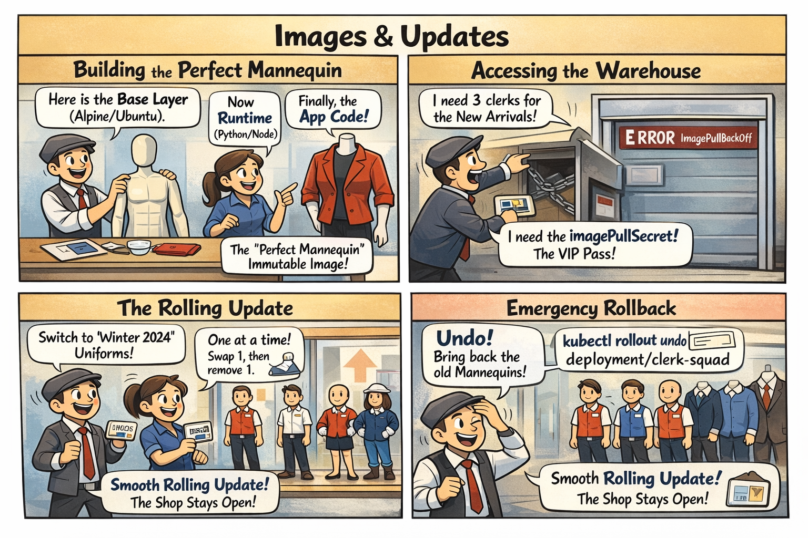

# 🎭 The Perfect Mannequin

This comic explains:
- How **Container Images** (Mannequins) are built in layers
- How **Rolling Updates** swap old models for new ones
- Why the **Registry** is like a VIP warehouse pass

📌 Read this if:
- You are working on **[LAB 03](/labs/pod-design/lab03-image-updates/README.md)**.
- You want to understand **Image Layers & Rollouts**
- You want a quick **mental model** using the mall analogy 😄

🔗 References:
- Docs → [Kubernetes Docs: Updating a Deployment](../../../docs/md-resources/managing-container-images-and-rollouts.md)
- Lab → [`labs/pod-design/lab03-image-updates`](../../../labs/pod-design/lab03-image-updates/README.md)

---

# 📖 Comic Script (Text Version)

*> **Scene 1:** The window display needs a refresh. In the mall, we don't repaint the workers; we swap the mannequins.*

---

### Frame 1: The Base Layer
**Tailor (Docker):** "Here is the standard plastic base. That's our **Base Image** (Alpine/Ubuntu)."
**Designer:** "Now add the internal gears. That's the **Runtime** (Python/Node)."
**Designer:** "Finally, dress it in our uniform. That's the **App Code**."
**Result:** "The 'Perfect Mannequin' is ready! It's an **Immutable Image**."

---

### Frame 2: The Warehouse (Registry)
**Manager (K8s):** "We need 3 clerks for the New Arrivals section."
**Manager:** "Wait, I don't have the key to the **Private Warehouse**!"
**System:** `ImagePullBackOff` ❌
**Manager:** "Quick, get the `imagePullSecret`! It's the VIP pass for the warehouse."

---

### Frame 3: The Rolling Update
**Manager:** "HQ says we need to switch from the 'Summer 2023' uniform to 'Winter 2024'."
**Manager:** "Don't swap them all at once! Customers will see an empty shop."
**Manager:** "Swap **one at a time**. Bring in 1 new mannequin, then remove 1 old one."
**Result:** "A smooth **Rolling Update**. The shop never closed!" 👗✨

---

### Frame 4: The Rollback
**Staff:** "Wait! The new uniform has no pockets! The clerks can't hold their scanners!"
**Manager:** "**Undo!** Bring back the old mannequins from the backroom immediately!"
**Command:** `kubectl rollout undo deployment/clerk-squad`
**Result:** "The shop is back to normal. crisis averted." 😅

---

> **Key Takeaway:**
> - **Images**: Built in layers, never changed once created.
> - **Rolling Updates**: Gradual replacement to ensure zero downtime.
> - **Rollback**: Keeping the "old versions" in the backroom just in case.

---

## 🔗 References
- Chapter → [Chapter 3: Pod Design & Images](../../../sources/study-guide/ch03-pod-design.md)
