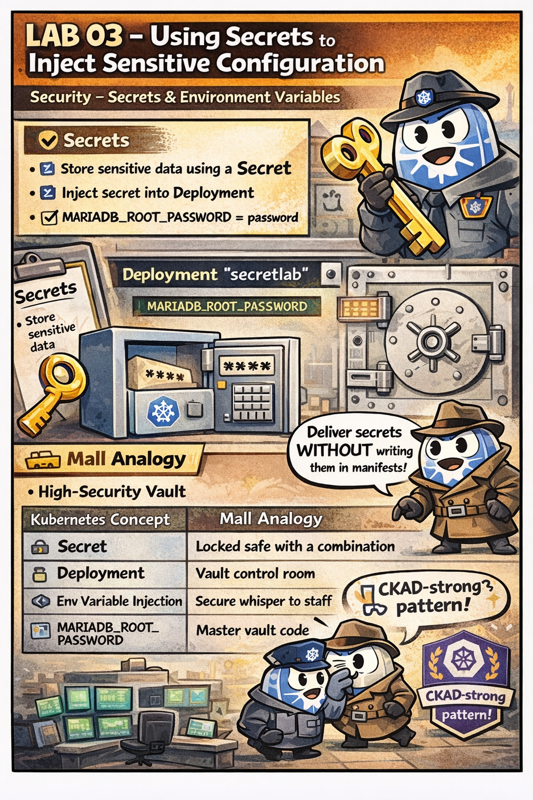

# 🕵️ The Secret of the High-Security Vault

This comic explains:

- How to store sensitive data in a **Kubernetes Secret**
- How to inject secret values into a **Deployment** as environment variables
- The CKAD-safe way to handle passwords without hardcoding them

📌 Read this if:
- You are working on **LAB 03**
- You want to understand **Secrets & Environment Variables**
- You want a quick **mental model** using the mall analogy 😄

🔗 References:
- Docs → `docs/md-resources/core-concepts-configmaps-secrets-and-security.md`
- Lab → `labs/security/lab03-secrets-env-injection`
