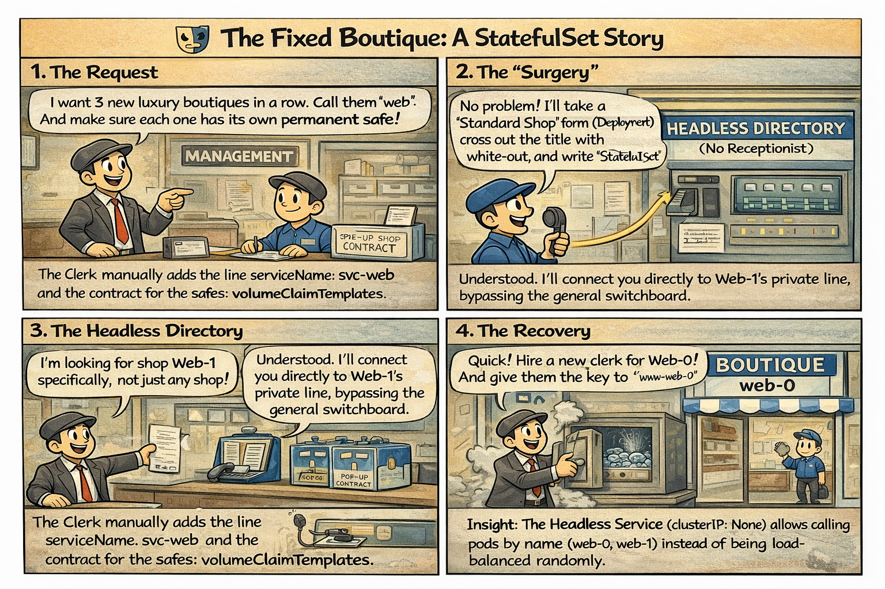

# 🎭 The Fixed Boutique: A StatefulSet Story

This comic explains why **StatefulSets** are the "VIPs" of the Kubernetes world and why their identity is tied to both their name and their "Warehouse Safe" (Volume).

📌 **Read this if:**
- You are working on **[LAB 02](/labs/storage/lab02-statefulsets/README.md)**.
- You struggle to remember why a **Headless Service** is mandatory.
- You want to visualize the concept of the **Ordinal Index** (0, 1, 2).

---

## 🛍️ Mall Analogy: The Boutique Row

In the **Central Mall**, standard shops (Deployments) are like pop-up kiosks: if one closes, we open an identical one anywhere there's space. But in **Boutique Row**, things are different:

* **The Name is the Address:** If shop `web-0` closes, it must reopen exactly as `web-0`. It cannot become `web-3`.
* **The Personal Safe:** Every owner has a key to a specific safe in the basement. If the owner of `web-1` leaves, the successor inherits the `web-1` safe, not a random one.

---

## 📖 Comic Script (Text Version)

### Panel 1: The Request
**Mall Manager:** "I want 3 new luxury boutiques in a row. Call them 'web'. And make sure each one has its own permanent safe!"
**Clerk:** "But sir, I don't have a pre-printed form for 'Fixed Boutiques' (StatefulSet)!"

### Panel 2: The "Surgery"
**Clerk:** "No problem! I'll take a 'Standard Shop' form (Deployment), cross out the title with white-out, and write **StatefulSet**."
**Narrator:** The Clerk manually adds the line `serviceName: svc-web` and the contract for the safes: `volumeClaimTemplates`.

### Panel 3: The Headless Directory
**Customer:** "I'm looking for shop Web-1 specifically, not just any shop!"
**Mall Intercom (Headless Service):** "Understood. I'll connect you directly to Web-1's private line, bypassing the general switchboard."
- **Insight:** The Headless Service (`clusterIP: None`) allows calling pods by name (`web-0`, `web-1`) instead of being load-balanced randomly.

### Panel 4: The Recovery
**Web-0 Pod:** *Collapses (Crash)*
**Mall Manager:** "Quick! Hire a new clerk for Web-0! And give them the key to the 'www-web-0' safe!"
**New Web-0:** "Thanks! Hey, the diamonds from my predecessor are still here!" (Persistence Success).

---

## 🧠 Key Takeaways (CKAD Mindset)

> **The Central Mall Golden Rule:**
> A Deployment is an army of anonymous clones. 
> A StatefulSet is a parade of individuals with a name and a memory.

* **Identity:** Pod names persist across restarts (`web-0` always returns as `web-0`).
* **Storage:** Each Pod gets its own dedicated PVC generated from the template.
* **Ordering:** Created one by one (0 -> 1 -> 2) and terminated in reverse order.

---

## 🔗 References
* 🧪 **Lab:** [LAB 02 – The Fixed Boutique](/labs/storage/lab02-statefulsets/README.md)
* 📖 **Docs:** [Using StatefulSets](/docs/md-resources/using-statefulsets.md)  
* 🗄️ **Storage:** [Verifying Warehouse Safes](/labs/storage/lab02-statefulsets/README.md#verifying-the-warehouse-safes)