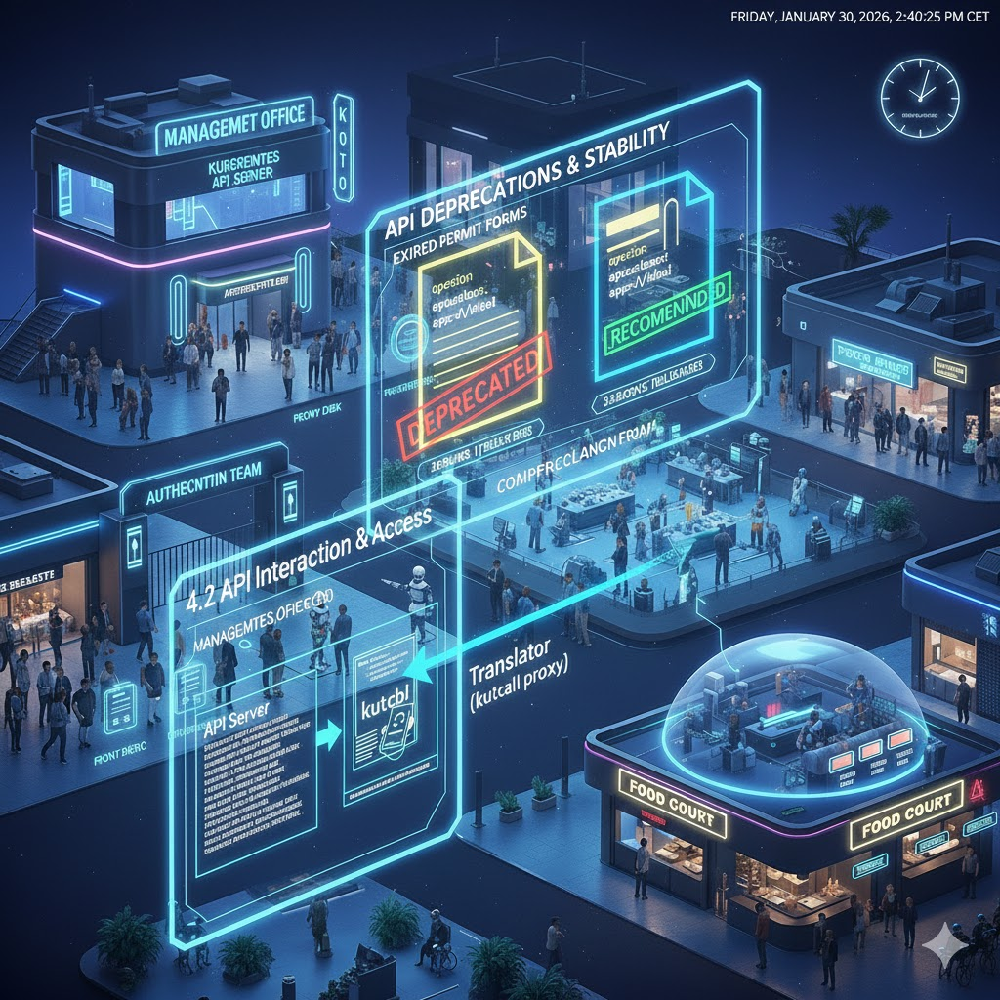

## 4.2 API Interaction and Access

The core functionality of Kubernetes is exposed through its API, which is a critical component for all interactions, including those initiated by \`kubectl\`.

[Back to Documentation](https://github.com/maobat/kubernetes-central-mall/tree/main/docs#documentation)
