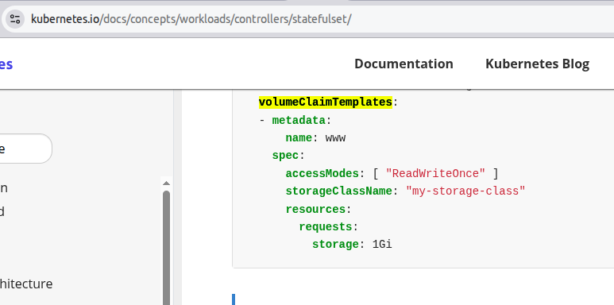

# 🧪 LAB 02: The Fixed Boutique (StatefulSets)
## Pod Design – Managing Stateful Applications

## 🎯 Lab Goal
Since there is no `kubectl create statefulset` command, you must learn the "Exam Speed-Run" method: Generating a Deployment scaffold and manually converting it into a **StatefulSet**.

---
## 📖 Related Comic
👉 [comics/storage/02-statefulsets/README.md](../../../comics/storage/02-statefulsets/README.md)

It explains **StatefulSets (Fixed Boutiques)**.

---
## 📖 Reference Docs

- StatefulSets → [Kubernetes Docs: Using StatefulSets](../../../docs/md-resources/using-statefulsets.md)

---

## 📋 Requirements

1. **Create a Headless Service**:
   - Name: `svc-web`
   - Type: `ClusterIP` with `None` specified.
   - Port: `80`.

2. **Create a StatefulSet**:
   - Name: `web`
   - Replicas: `3`
   - Image: `registry.k8s.io/nginx-slim:0.24`
   - Service Link: Connect to `svc-web`.
   - Storage: Mount a volume named `www` at `/usr/share/nginx/html`.
   - Persistence: Use a `volumeClaimTemplate` (1Gi, `ReadWriteOnce`, `standard` storage class).

3. **Verify Persistence**:
   - Create a file inside `web-0`.
   - Delete the pod `web-0`.
   - Confirm the new `web-0` pod retains the file.

---

## 🏬 Mall Analogy
Unlike standard clerks (Deployments) who are replaceable and anonymous, **StatefulSet** workers are like specialized shop owners.
* Each has a **Fixed Address** (Ordinal index: 0, 1, 2).
* Each has their own **Personal Safe** (Persistent Volume) that follows them if they move.

| Kubernetes Concept | Mall Analogy |
| :--- | :--- |
| **StatefulSet** | A row of boutiques with permanent IDs (Shop-0, Shop-1). |
| **Headless Service** | The mall directory that points to specific shop IDs instead of a random clerk. |
| **volumeClaimTemplate** | The contract that ensures Shop-0 always gets Warehouse-Safe-0. |

---

## 🛠️ The Blueprint (CKAD Speed-Run)

# ⚡ The Imperative Speed-Run
*Generating StatefulSets without typing the whole YAML*

In the **Central Mall**, if you don`t have a pre-printed form (StatefulSet), you take a standard Employment Contract (Deployment), cross out the name, and scribble in the special rules.

---

## 🛠️ Step 1: The Headless Service
We generate the "Mall Directory" first. The key is `--clusterip=None`.

```bash
 k create svc clusterip svc-web --tcp=80:80 --clusterip=None $do > sfs.yaml
```

---

## 🛠️ Step 2: The Scaffold (Deployment)
We use the Deployment generator to build the container, labels, and image. We append it to our file with `---`.

```bash
echo "---" >> sfs.yaml

k create deploy web --image=registry.k8s.io/nginx-slim:0.24 --replicas=3 $do >> sfs.yaml
```


---
## 🛠️ Step 3: The Surgery (Manual Edits)
Open `sfs.yaml` in `vi`. This is where you connect the "Directory" to the "Shop."

**1. Clean Up:**
Remove the generated unused lines.
```yaml
creationTimestamp: null

strategy: {}
```

**2. Kind & Identity:**
```yaml
kind: StatefulSet # From Deployment
spec:
  serviceName: "svc-web" # MUST match the Service name
```

**3. The Storage Connection:**
Add these two blocks. Note that `name: www` must match in both places.

```yaml
# A. Inside the container spec:
  volumeMounts:
  - name: www
    mountPath: /usr/share/nginx/html
```

```yaml
# B. At the bottom of the StatefulSet spec (same level as 'template'):
```


> Note that `standard` is the name of the StorageClass to use. You can check the available storage classes with `k get sc`.
---

## 📝 CKAD Cheat Sheet: The Resulting Checklist
When you finish your "Surgery," check these 4 points:
* [ ] **Service:** `clusterIP: None`?
* [ ] **Selectors:** Does Service `selector.app` match Pod `labels.app`?
* [ ] **Link:** Does StatefulSet `serviceName` match Service `metadata.name`?
* [ ] **Storage:** Does `volumeMounts[0].name` match `volumeClaimTemplates[0].metadata.name`?

---

## 🔎 Verification
Apply your manifest and watch the "Ordered Startup":
```bash
k apply -f sfs.yaml
k get pods -w
```

✅ **Success Check:** You should see pods starting one-by-one: `web-0`, then `web-1`, then `web-2`.

---
# 🔍 Verifying the Warehouse Safes
*Tracking PVCs in a StatefulSet*

When you use a `volumeClaimTemplate`, Kubernetes acts as an automated lawyer. It creates a **PersistentVolumeClaim (PVC)** for every pod index. Unlike a Deployment, if `web-0` faints and a new `web-0` is hired, the new clerk automatically picks up the old `web-0` contract.

---

## 🛠️ The Inspection Toolkit

### 1. The Quick Inventory
See all the active rental contracts in your floor (Namespace).

```bash
k get pvc
```

**What to look for:**
* **NAME:** Will follow the pattern `{ClaimName}-{PodName}-{Index}` (e.g., `www-web-0`).
* **STATUS:** Should be `Bound`. This means the safe is successfully locked to the shop.
* **VOLUME:** This is the ID of the actual physical safe (PV) in the basement.


---

## 🔬 2. The Deep Dive (Which Pod has which Safe?)
If you want to see exactly how the "Boutique" is holding the "Safe," inspect the Pod itself.

```bash
k describe pod web-0
```

**Scroll down to the `Volumes` section. You will see:**
```text
Volumes:
  www:
    Type:       PersistentVolumeClaim (a reference to a PersistentVolumeClaim in the same namespace)
    ClaimName:  www-web-0
    ReadOnly:   false
```

---

## 🛠️ 3. The "CCTV" Check (Testing Data Persistence)
The best way to verify the PVC is working is to let the clerk write a "Secret Note" in the safe, fire the clerk, and see if the new clerk can read it.

```bash
# 1. Write a note in web-0
k exec web-0 -- sh -c 'echo "Boutique 0 Secret" > /usr/share/nginx/html/index.html'

# 2. Fire the clerk (Delete the pod)
k delete pod web-0

# 3. Wait for the replacement and read the note
k exec web-0 -- cat /usr/share/nginx/html/index.html
```

✅ **Success:** If the note still says "Boutique 0 Secret," the PVC successfully held the data while the worker was being replaced!

---
## 📖 Related Chapter
👉 [sources/study-guide/ch01-workloads.md](../../../sources/study-guide/ch01-workloads.md)

## 📝 Key Takeaways (CKAD Mindset)

* **ServiceName** in the StatefulSet must match the Service's `metadata.name`.
* **No Imperative command** exists for StatefulSets. Use the Deployment scaffold!
* **Headless Service** is mandatory (`clusterIP: None`).
* **Identity:** Pod names persist across restarts (`web-0` always returns as `web-0`).
* **Storage:** Each Pod gets its own dedicated PVC generated from the template.
* **Ordering:** Created one by one (0 -> 1 -> 2) and terminated in reverse order.

---
