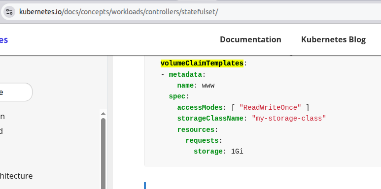

# 🧪 LAB 02: The Fixed Boutique (StatefulSets)

## Pod Design – Managing Stateful Applications

---

## 🎯 Lab Goal

Since there is no `kubectl create statefulset` command, you must learn the "Exam Speed-Run" method: Generating a Deployment scaffold and manually converting it into a **StatefulSet**.

> **CKAD Importance:** Crucial. StatefulSets are often where students lose time due to manual YAML editing.

---

## 🛍️ Mall Analogy

Unlike standard clerks (Deployments) who are replaceable and anonymous, **StatefulSet** workers are like specialized shop owners.

- **Fixed Address (Ordinal Index)** → Each owner has a permanent spot: Shop-0, Shop-1, Shop-2. They never swap places.
- **The Directory (Headless Service)** → A specific mall directory that lets you dial "Boutique-0" directly instead of getting a random worker.
- **Personal Safes (Persistent Volumes)** → Each shop has its own dedicated safe. If an owner leaves and a new one is hired for Shop-0, they inherited the *same* safe that belonged to Shop-0 before.

| Kubernetes Concept | Mall Analogy |
| :--- | :--- |
| **StatefulSet** | A row of boutiques with permanent IDs. |
| **Headless Service** | The direct-dial directory (`clusterIP: None`). |
| **volumeClaimTemplate** | The contract that ensures Shop-X always gets Safe-X. |

---

## 📋 Requirements

1. **Create a Headless Service**:
   - Name: `svc-web`
   - Type: `ClusterIP` with `None` specified.
   - Port: `80`.

2. **Create a StatefulSet**:
   - Name: `web`
   - Replicas: `3`
   - Image: `registry.k8s.io/nginx-slim:0.24`
   - Service Link: Connect to `svc-web`.
   - Storage: Mount a volume named `www` at `/usr/share/nginx/html`.
   - Persistence: Use a `volumeClaimTemplate` (1Gi, `ReadWriteOnce`, `standard` storage class).

---

## 🛠️ Step-by-Step Solution (Speed-Run)

### 1. The Headless Service
The key is `--clusterip=None`.
```bash
k create svc clusterip svc-web --tcp=80:80 --clusterip=None $do > sfs.yaml
```

### 2. The Deployment Scaffold
Generate the container spec and append it.
```bash
echo "---" >> sfs.yaml
k create deploy web --image=registry.k8s.io/nginx-slim:0.24 --replicas=3 $do >> sfs.yaml
```

### 3. The Surgery (Manual Edits)
Open `sfs.yaml` and perform these transforms:
1. Change `kind: Deployment` to `kind: StatefulSet`.
2. Add `serviceName: "svc-web"` under the first `spec:`.
3. Add `volumeMounts` inside the container.
4. Add the `volumeClaimTemplates` block at the bottom of the StatefulSet `spec`.

    

    > Note that `standard` is the name of the StorageClass to use. You can check the available storage classes with `k get sc`.

---

## 🔎 Verification

1. **Ordered Startup:**
   ```bash
   k apply -f sfs.yaml
   k get pods -w
   # Watch them start one-by-one: web-0, then web-1...
   ```

2. **Test Persistence:**
   ```bash
   # Write data to web-0
   k exec web-0 -- sh -c 'echo "Boutique 0 Secret" > /usr/share/nginx/html/index.html'
   
   # Delete web-0
   k delete pod web-0
   
   # Wait for recreation and check
   k exec web-0 -- cat /usr/share/nginx/html/index.html
   ```

---

## 🧠 Key Takeaways

- **ServiceName Link:** The `serviceName` in the SS *must* match the `metadata.name` of the Headless Service.
- **Identity:** Pod names are 100% predictable: `{name}-0`, `{name}-1`.
- **Storage Sticky-ness:** PVCs created by SS are *never* automatically deleted when the SS is deleted. You must clean them up manually if you want to save space.
- **CKAD Tip:** If the question asks for a "Stable Network Identity," they are almost always asking for a StatefulSet + Headless Service.

---

## 🔗 References
- **Comic** → [StatefulSets](../../../../visual-learning/comics/ch01-workloads/02-statefulsets/README.md)
- **Docs** → [Using StatefulSets](../../../../reference/md-resources/using-statefulsets.md)
- **Study Guide** → [Chapter 1: Workloads](../../../../sources/study-guide/ch01-workloads.md)
