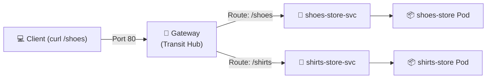

# Lab: Gateway API Path-Based Routing (The Transit Hub)

In this lab, you will configure a modern **Kubernetes Gateway** and an **HTTPRoute** to set up path-based routing for two distinct store units in the Central Mall: the **Shoe Store** and the **Shirt Store**.

---

## 🛍️ Mall Analogy

We are installing a new **Transit Hub (Gateway)** at the entrance of the Central Mall. Incoming customers arriving at this station will look at the **Signage (HTTPRoute)** to decide which direction to take:
* If they want `/shoes`, they are directed to the **Shoe Store Service**.
* If they want `/shirts`, they are directed to the **Shirt Store Service**.

---

## 🏗️ Topology & Architecture



---

## ⚡ Prerequisites

To practice Gateway API on a local cluster (such as Kind or Minikube), you must first install the official Gateway API Custom Resource Definitions (CRDs). Apply them by running:

```bash
kubectl apply -f https://github.com/kubernetes-sigs/gateway-api/releases/download/v1.0.0/standard-install.yaml
```

---

## 🛠️ Step-by-Step Implementation

### Step 1: Create the Storefront Pods and Services

We will deploy two separate pods representing our shops, each serving a custom home page so we can easily verify routing.

1. **Deploy the Shoe Store:**
   ```bash
   kubectl run shoes-store --image=nginx --port=80
   # Create a custom landing page inside the pod
   kubectl exec shoes-store -- sh -c 'echo "Welcome to the Shoes Store! 👟" > /usr/share/nginx/html/index.html'
   # Expose the pod as a Service
   kubectl expose pod shoes-store --name=shoes-store-svc --port=80
   ```

2. **Deploy the Shirt Store:**
   ```bash
   kubectl run shirts-store --image=nginx --port=80
   # Create a custom landing page inside the pod
   kubectl exec shirts-store -- sh -c 'echo "Welcome to the Shirts Store! 👕" > /usr/share/nginx/html/index.html'
   # Expose the pod as a Service
   kubectl expose pod shirts-store --name=shirts-store-svc --port=80
   ```

---

### Step 2: Define the Physical Entrance (`gateway.yaml`)

Next, we create the `Gateway` resource, which tells the cluster to allocate a listener on Port 80.

Create the file [**`gateway.yaml`**](./gateway.yaml):

```yaml
apiVersion: gateway.networking.k8s.io/v1
kind: Gateway
metadata:
  name: mall-gateway
  namespace: default
spec:
  gatewayClassName: local-gateway-class
  listeners:
  - name: http
    protocol: HTTP
    port: 80
    allowedRoutes:
      namespaces:
        from: Same
```

Apply the file to your cluster:
```bash
kubectl apply -f gateway.yaml
```

*Note: In a production cluster, `gatewayClassName` will reference a class provided by your cloud provider (e.g. `gke-l7-gxlb`) or your service mesh/ingress controller (e.g. `envoy-gateway` or `istio`). For testing manifest syntax, the object will apply successfully even without a running controller.*

---

### Step 3: Configure the Signage routes (`httproute.yaml`)

Now, we define the `HTTPRoute` which binds to the `mall-gateway` and maps URL paths to our backend services.

Create the file [**`httproute.yaml`**](./httproute.yaml):

```yaml
apiVersion: gateway.networking.k8s.io/v1
kind: HTTPRoute
metadata:
  name: storefront-route
  namespace: default
spec:
  parentRefs:
  - name: mall-gateway
  rules:
  - matches:
    - path:
        type: PathPrefix
        value: /shoes
    backendRefs:
    - name: shoes-store-svc
      port: 80
  - matches:
    - path:
        type: PathPrefix
        value: /shirts
    backendRefs:
    - name: shirts-store-svc
      port: 80
```

Apply the file to your cluster:
```bash
kubectl apply -f httproute.yaml
```

---

## 🔍 Verification & Diagnostics

1. **Verify Resources:**
   Ensure the route has successfully bound to the gateway:
   ```bash
   kubectl get gateway
   kubectl get httproute
   ```

2. **Inspect the Status (Crucial for CKAD):**
   Run describe on the Gateway to see if it is accepted and programmed:
   ```bash
   kubectl describe gateway mall-gateway
   ```
   Look for the `Conditions` block in the output:
   * `Accepted: True` $\rightarrow$ The syntax is valid.
   * `Programmed: True` $\rightarrow$ The controller has built the load balancer infrastructure.

3. **Verify Route Matching Rules:**
   Describe the HTTPRoute to check its attachment status:
   ```bash
   kubectl describe httproute storefront-route
   ```
   Verify that `parentRefs` shows the gateway name and the status is `Accepted: True`.

---

## 🧼 Cleanup

Tear down all deployed resources to leave the cluster clean:
```bash
kubectl delete httproute storefront-route
kubectl delete gateway mall-gateway
kubectl delete svc shoes-store-svc shirts-store-svc
kubectl delete pod shoes-store shirts-store
```

---

> **Disclaimer:** *Kubernetes®, CKAD, and CNCF are registered trademarks of The Linux Foundation. This project is an independent educational resource and is not affiliated with, sponsored by, or officially endorsed by The Linux Foundation or the Cloud Native Computing Foundation (CNCF).*
