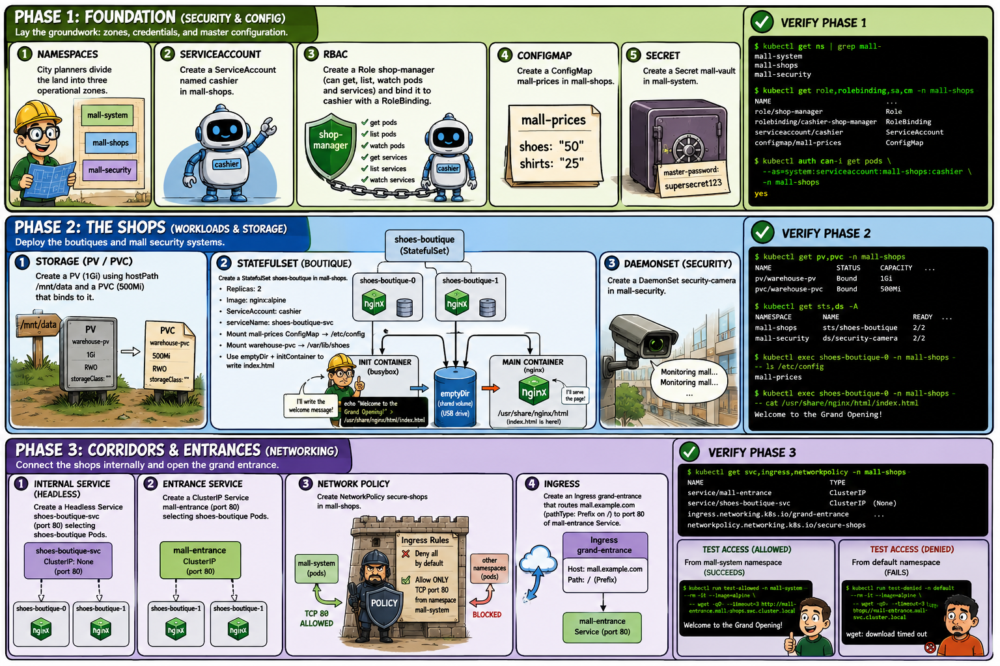
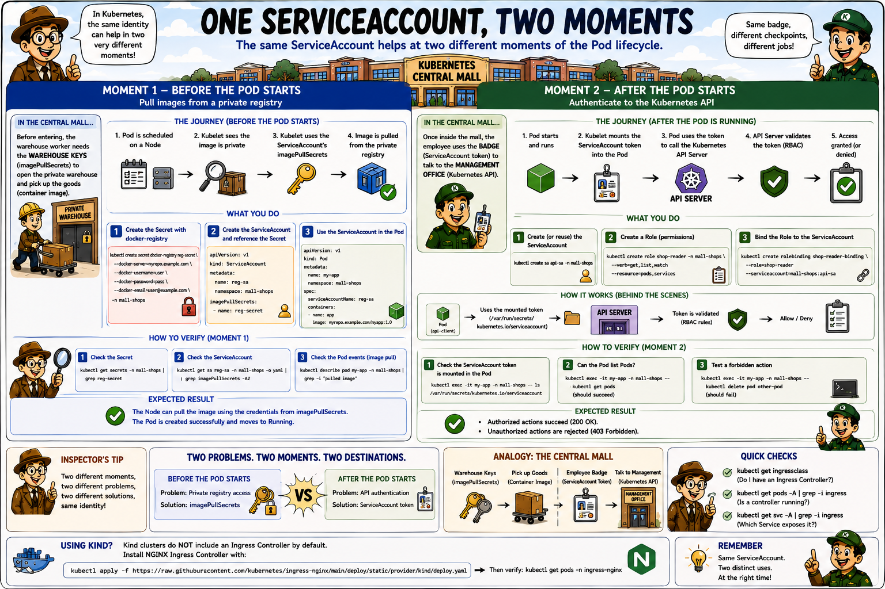
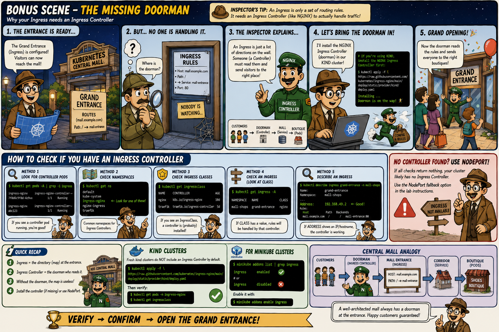

# 🏆 Lab 17.01 – The Grand Opening
## A CKAD Capstone Mission

Welcome to the ultimate test of your **Kubernetes Central Mall** architectural skills. Everything you have learned leads here.

Attempt this mission on a local cluster such as **kind** or **minikube**, where you can verify storage, networking, NetworkPolicies, and Ingress behaviour. The completed manifests are available in [`solutions/`](solutions/) only when you need to compare your work.

---

## 📜 Mission Brief

| Field | Assignment |
|---|---|
| **Date** | Tonight |
| **Location** | Kubernetes Central Mall |
| **Role** | Chief Mall Architect |
| **Objective** | Open the mall before 9:00 AM tomorrow |

You have one night to:

- prepare the infrastructure;
- secure the mall;
- deploy the boutiques;
- configure customer traffic;
- verify that everything is operational;
- survive the Inspector's final visit.

**Failure is not an option. Good luck, Architect.**



---

# 🏗️ Phase 1 — The City Is Built
## Foundation: Security and Configuration

### 🎬 Story

Before a single boutique can open, city planners must divide the land into operational districts. The security office issues employee identities and permissions, the pricing department publishes the official catalogue, and the vault team protects the master password.

### 🎯 Your mission

1. **Namespaces** — Create the three operational zones:
   - `mall-system`
   - `mall-shops`
   - `mall-security`
2. **ServiceAccount** — In `mall-shops`, create a ServiceAccount named `cashier`.
3. **RBAC** — In `mall-shops`:
   - create a Role named `shop-manager`;
   - allow `get`, `list`, and `watch` on `pods` and `services`;
   - bind it to the `cashier` ServiceAccount with a RoleBinding named `cashier-shop-manager`.
4. **ConfigMap** — Create `mall-prices` in `mall-shops` with:

   ```yaml
   shoes: "50"
   shirts: "25"
   ```

5. **Secret** — Create a generic Secret named `mall-vault` in `mall-system` containing:

   ```text
   master-password=supersecret123
   ```

### 🕵️ Inspector's Tip — One badge, two moments

A ServiceAccount is the workload's identity. It may participate at two different moments:

- **before a Pod starts**, through `imagePullSecrets`, so the node can obtain a private image;
- **after the Pod starts**, through its projected ServiceAccount token, so the workload can authenticate to the Kubernetes API.

The `cashier` identity in this mission is used for the second case: its API permissions come from the RoleBinding.



### 🏗️ Build hints

```bash
kubectl create namespace mall-system
kubectl create namespace mall-shops
kubectl create namespace mall-security

kubectl create serviceaccount cashier -n mall-shops

kubectl create role shop-manager \
  --verb=get,list,watch \
  --resource=pods,services \
  -n mall-shops

kubectl create rolebinding cashier-shop-manager \
  --role=shop-manager \
  --serviceaccount=mall-shops:cashier \
  -n mall-shops

kubectl create configmap mall-prices \
  --from-literal=shoes=50 \
  --from-literal=shirts=25 \
  -n mall-shops

kubectl create secret generic mall-vault \
  --from-literal=master-password=supersecret123 \
  -n mall-system
```

### ✅ Verify Phase 1

```bash
kubectl get ns | grep mall-
kubectl get role,rolebinding,sa,cm -n mall-shops
kubectl get secret mall-vault -n mall-system

kubectl auth can-i get pods \
  --as=system:serviceaccount:mall-shops:cashier \
  -n mall-shops
```

Expected RBAC result:

```text
yes
```

Optional full permission check:

```bash
for verb in get list watch; do
  for resource in pods services; do
    printf '%-6s %-10s ' "$verb" "$resource"
    kubectl auth can-i "$verb" "$resource" \
      --as=system:serviceaccount:mall-shops:cashier \
      -n mall-shops
  done
done
```

---

# 🏬 Phase 2 — The Shops Come Alive
## Workloads and Storage

### 🎬 Story

Construction crews arrive. A permanent warehouse is prepared, boutiques are assembled in a stable order, and security cameras are installed across the mall. Before nginx opens its doors, a construction worker enters each boutique and leaves the Grand Opening welcome page behind.

### 🎯 Your mission

#### 1. Storage

Create a PersistentVolume named `warehouse-pv`:

- capacity: `1Gi`;
- access mode: `ReadWriteOnce`;
- `storageClassName: ""`;
- `hostPath: /mnt/data`.

Create a PersistentVolumeClaim named `warehouse-pvc` in `mall-shops`:

- request: `500Mi`;
- access mode: `ReadWriteOnce`;
- `storageClassName: ""`.

The PVC must bind to `warehouse-pv`, not to a dynamically provisioned volume.

### 🕵️ Inspector's Tip — "Requested" vs "Assigned"

You requested **500Mi**.
Why does Kubernetes report **1Gi**?
Because a PersistentVolumeClaim requests the **minimum** storage it needs.
After binding, the PVC represents the **entire PersistentVolume**.
Think of it as renting a warehouse.
You ask for enough space to store 500 boxes.
If the only available warehouse stores 1,000 boxes, you receive the entire warehouse—not just half of it.

#### 2. StatefulSet

Create `shoes-boutique` in `mall-shops`:

- replicas: `2`;
- image: `nginx:alpine`;
- ServiceAccount: `cashier`;
- governing service: `shoes-boutique-svc`;
- declare `containerPort: 80`;
- mount `mall-prices` at `/etc/config`;
- mount `warehouse-pvc` in the main nginx container at `/var/lib/shoes`.

#### 3. InitContainer

Add an init container using `busybox:1.36` that writes:

```text
Welcome to the Grand Opening!
```

to:

```text
/usr/share/nginx/html/index.html
```

Use a shared `emptyDir` mounted at `/usr/share/nginx/html` in both the init container and nginx.

#### 4. DaemonSet

Create `security-camera` in `mall-security`:

- image: `busybox:1.36`;
- command:

  ```yaml
  ["sh", "-c", "while true; do echo 'Monitoring mall...'; sleep 10; done"]
  ```

### 🕵️ Inspector's Tip — The construction worker and the shared USB drive

The init container arrives first, mounts the shared `emptyDir`, writes `index.html`, and exits. The nginx container then mounts the same directory and finds the completed welcome page. The data survives the init container's exit because it belongs to the Pod volume, not to the init container filesystem.

Declaring `containerPort: 80` does not expose the Pod. It documents the expected listening port and can be reused by tools and named-port references.

### 🏗️ Build hints

There is no dedicated imperative generator for a PV, StatefulSet, or DaemonSet. Write their YAML directly, or generate a nearby resource and carefully transform it.

Apply your work:

```bash
kubectl apply -f ownsolutions/pv.yaml
kubectl apply -f ownsolutions/pvc.yaml
kubectl apply -f ownsolutions/sts-shoes-boutique.yaml
kubectl apply -f ownsolutions/ds-security.yaml
```

Or apply the entire directory:

```bash
kubectl apply -f ownsolutions/
```

### ✅ Verify Phase 2

```bash
kubectl get pv warehouse-pv
kubectl get pvc warehouse-pvc -n mall-shops
kubectl get sts -n mall-shops
kubectl get ds -n mall-security
kubectl get pods -n mall-shops -o wide

kubectl exec -n mall-shops shoes-boutique-0 -c nginx -- \
  ls /etc/config

kubectl exec -n mall-shops shoes-boutique-0 -c nginx -- \
  cat /etc/config/shoes

kubectl exec -n mall-shops shoes-boutique-0 -c nginx -- \
  cat /usr/share/nginx/html/index.html
```

Expected content:

```text
50
Welcome to the Grand Opening!
```

> `kubectl get pv,pvc -n mall-shops` still shows every PV because PersistentVolumes are cluster-scoped. Query `warehouse-pv` directly for cleaner output.

---

# 🌐 Phase 3 — Opening the Corridors
## Services, NetworkPolicy, and the Grand Entrance

### 🎬 Story

The boutiques are running, but customers still have no route to them. Internal corridors must provide stable discovery, the public entrance needs a single destination, and security barriers must admit only authorised traffic. Finally, the Grand Entrance needs a doorman who can read the routing map.

### 🎯 Your mission

#### 1. Internal Service

Create a headless Service named `shoes-boutique-svc` in `mall-shops`:

- `clusterIP: None`;
- expose port `80` and target port `80`;
- select Pods labelled `app=shoes-boutique`.

#### 2. Entrance Service

Create a ClusterIP Service named `mall-entrance` in `mall-shops`:

- expose port `80` and target port `80`;
- select Pods labelled `app=shoes-boutique`.

#### 3. NetworkPolicy

Create `secure-shops` in `mall-shops`:

- apply to every Pod with `podSelector: {}`;
- isolate ingress traffic;
- allow TCP port `80` only from Pods in the `mall-system` namespace;
- do not restrict egress.

Use the standard namespace label:

```yaml
kubernetes.io/metadata.name: mall-system
```

#### 4. Ingress

Create `grand-entrance` in `mall-shops`:

- host: `mall.example.com`;
- path: `/`;
- `pathType: Prefix`;
- backend: `mall-entrance` on port `80`.

If your environment has no Ingress Controller, use a NodePort fallback for `mall-entrance`.

### 🕵️ Inspector's Tip — The missing doorman

An Ingress is a routing map, not a traffic-processing component. The Ingress Controller is the doorman who reads that map and forwards visitors to the correct Service.



Check whether a controller is present:

```bash
kubectl get ingressclass
kubectl get pods -A | grep -i ingress
kubectl get svc -A | grep -i ingress
```

For minikube:

```bash
minikube addons list | grep ingress
minikube addons enable ingress
```

For kind, a fresh cluster normally needs a controller installed separately. Use the deployment instructions that match your kind and ingress-nginx versions rather than blindly relying on an old pinned URL.

> **NetworkPolicy caveat:** a controller running in a namespace such as `ingress-nginx` will also be blocked by this mission's strict policy. The ClusterIP policy test below remains valid. To test the public Ingress end to end, either run the controller in `mall-system` or explicitly allow its namespace as an additional source.

### 🏗️ Build hints

Generate the headless Service skeleton:

```bash
kubectl create service clusterip shoes-boutique-svc \
  --clusterip=None \
  --tcp=80:80 \
  -n mall-shops \
  --dry-run=client -o yaml > ownsolutions/shoes-boutique-svc.yaml
```

Then ensure its selector is:

```yaml
selector:
  app: shoes-boutique
```

Generate the entrance Service:

```bash
kubectl create service clusterip mall-entrance \
  --tcp=80:80 \
  -n mall-shops \
  --dry-run=client -o yaml > ownsolutions/mall-entrance-svc.yaml
```

Again, ensure the selector is `app=shoes-boutique`.

`kubectl expose` cannot expose a StatefulSet, so create these Services separately.

### ✅ Verify Phase 3

```bash
kubectl get svc,ingress,networkpolicy -n mall-shops
kubectl get endpointslice -n mall-shops \
  -l kubernetes.io/service-name=shoes-boutique-svc
kubectl get endpointslice -n mall-shops \
  -l kubernetes.io/service-name=mall-entrance
```

Both Services should resolve to the two boutique Pod IPs.

Test approved traffic:

```bash
kubectl run test-allowed \
  -n mall-system \
  --rm -it \
  --restart=Never \
  --image=busybox:1.36 \
  -- wget -qO- --timeout=3 \
  http://mall-entrance.mall-shops.svc.cluster.local
```

Expected:

```text
Welcome to the Grand Opening!
```

Test rejected traffic:

```bash
kubectl run test-denied \
  -n default \
  --rm -it \
  --restart=Never \
  --image=busybox:1.36 \
  -- wget -qO- --timeout=3 \
  http://mall-entrance.mall-shops.svc.cluster.local
```

Expected: timeout or connection failure.

> The test Pod must be created in `mall-system` for the allowed case. A test Pod created inside `mall-shops` is denied by this policy because that namespace was not authorised as a source.

---

# 🩺 Phase 4 — Inspection Night
## Probes, Resource Budgets, and Placement

### 🎬 Story

The mall appears complete, but the Inspector does not accept “Running” as proof. The boutiques must demonstrate that they are alive, ready for customers, and operating within budget. Security cameras must also stand only in the secure zone.

### 🎯 Your mission

#### 1. Resource requests and limits

Update only the main nginx container:

```yaml
requests:
  memory: 64Mi
  cpu: 250m
limits:
  memory: 128Mi
  cpu: 500m
```

#### 2. Liveness probe

Use HTTP GET `/` on port `80`:

```yaml
initialDelaySeconds: 5
periodSeconds: 10
failureThreshold: 3
```

#### 3. Readiness probe

Use an exec probe:

```yaml
command:
  - test
  - -f
  - /etc/config/shoes
```

with:

```yaml
initialDelaySeconds: 5
periodSeconds: 5
```

#### 4. Strict node affinity

Label one node:

```bash
kubectl label node <NODE-NAME> mall-zone=secure
```

Update `security-camera` to require:

```text
requiredDuringSchedulingIgnoredDuringExecution
  → nodeSelectorTerms
    → matchExpressions
      → mall-zone In [secure]
```

### 🕵️ Inspector's Tip

- **Liveness:** “Should Kubernetes restart this container?”
- **Readiness:** “Should Services send customers to this Pod now?”
- **Requests:** the reserved operating budget used by the scheduler.
- **Limits:** the maximum budget the container may consume.
- **Required affinity:** a hard location rule; without a matching node, the Pod remains Pending.

### ✅ Verify Phase 4

```bash
kubectl get sts shoes-boutique -n mall-shops \
  -o jsonpath='{.spec.template.spec.containers[0].resources}'
echo

kubectl describe pod shoes-boutique-0 -n mall-shops \
  | grep -E 'Liveness|Readiness'

kubectl get nodes --show-labels | grep mall-zone
kubectl get pods -n mall-security -o wide
kubectl describe ds security-camera -n mall-security
```

---

# 🚨 Phase 5 — 9:00 AM: The Inspector Arrives
## Troubleshooting Challenge

### 🎬 Story

You believed the mall was ready. At exactly 9:00 AM, the Inspector enters with a clipboard.

Several overnight contractors made unauthorised changes. You may repair resources, but **do not delete and recreate the entire architecture**.

### 🔥 Operational fires

1. **Who removed the permits?**  
   The `cashier` identity can no longer read Pods. Restore its RBAC access.

2. **The warehouse reservation is stuck.**  
   `warehouse-pvc` remains Pending. Repair the PV/PVC binding without changing the requested size.

3. **The welcome sign has disappeared.**  
   nginx serves its default page. Restore the init-container-to-nginx shared-volume path.

4. **The corridor reaches no boutiques.**  
   One Service selector does not match the StatefulSet Pod labels.

5. **A contractor locked every entrance.**  
   Approved traffic from `mall-system` cannot reach TCP port 80. Repair the NetworkPolicy.

6. **The security team is in the wrong district.**  
   The DaemonSet is not restricted to `mall-zone=secure` nodes.

### ✅ Final inspection checklist

```bash
kubectl auth can-i get pods \
  --as=system:serviceaccount:mall-shops:cashier \
  -n mall-shops

kubectl get pv warehouse-pv
kubectl get pvc warehouse-pvc -n mall-shops
kubectl get sts shoes-boutique -n mall-shops
kubectl get ds security-camera -n mall-security
kubectl get svc,ingress,networkpolicy -n mall-shops

kubectl exec -n mall-shops shoes-boutique-0 -c nginx -- \
  cat /usr/share/nginx/html/index.html
```

---

# 🏅 Scoring

| Phase | Points |
|---|---:|
| Phase 1 — Foundation | 20 |
| Phase 2 — Workloads and Storage | 30 |
| Phase 3 — Networking | 25 |
| Phase 4 — Maintenance | 25 |
| **Total** | **100** |

| Score | Rank |
|---:|---|
| 90–100 | 🏆 Grand Architect |
| 75–89 | 🥇 Senior Mall Engineer |
| 50–74 | 🥈 Shop Builder |
| Below 50 | 🧰 Apprentice Architect |

---

# 🎉 10:00 AM — The Grand Opening

Customers enter the mall.

The corridors guide them to the correct boutiques. The pricing catalogue is mounted. The warehouse is bound. Security cameras watch the secure zone. Cashiers carry the correct permissions. The health Inspector gives a final nod.

The Mall Director smiles:

> “Congratulations, Architect. The Kubernetes Central Mall is officially open.”

## You are now ready for the CKAD exam.

---

# 📁 Repository layout

```text
ch17-capstone/
├── README.md
├── comics/
│   ├── 01-grand-opening-overview.png
│   ├── 02-one-serviceaccount-two-moments.png
│   ├── 03-the-missing-doorman.png
│   └── README.md
├── ownsolutions/
│   ├── ds-security.yaml
│   ├── mall-entrance-svc.yaml
│   ├── np-secure-shops.yaml
│   ├── pv.yaml
│   ├── pvc.yaml
│   ├── shoes-boutique-svc.yaml
│   └── sts-shoes-boutique.yaml
└── solutions/
    ├── README.md
    ├── phase1-foundation.yaml
    ├── phase2-workloads.yaml
    ├── phase3-networking.yaml
    └── phase4-maintenance.yaml
```

## Apply the official solutions

```bash
kubectl apply -f solutions/phase1-foundation.yaml
kubectl apply -f solutions/phase2-workloads.yaml
kubectl apply -f solutions/phase3-networking.yaml

# Label a node before applying Phase 4:
kubectl label node <NODE-NAME> mall-zone=secure
kubectl apply -f solutions/phase4-maintenance.yaml
```

## Clean up

```bash
kubectl delete -f solutions/phase4-maintenance.yaml --ignore-not-found
kubectl delete -f solutions/phase3-networking.yaml --ignore-not-found
kubectl delete -f solutions/phase2-workloads.yaml --ignore-not-found
kubectl delete -f solutions/phase1-foundation.yaml --ignore-not-found
```


---

## 🔗 References
- **Comic** → [Grand Opening Overview](comics/01-grand-opening-overview.png)
- **Docs** → [StatefulSets](https://kubernetes.io/docs/concepts/workloads/controllers/statefulset/) | [NetworkPolicy](https://kubernetes.io/docs/concepts/services-networking/network-policies/) | [Ingress](https://kubernetes.io/docs/concepts/services-networking/ingress/)
- **Study Guide** → [Chapter 09: Launch Strategies](../../../sources/study-guide/ch09-deployments.md) | [Chapter 13: Networking](../../../sources/study-guide/ch13-networking.md)
- **Simulator** → [CKAD Practice Simulator Guide](../../../reference/md-resources/ckad-exam/simulator/06-ckad-practice-simulator.md)

---
[Mall Directory ✨](../../../GLOSSARY.md)
