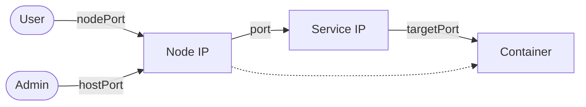

# 📖 Chapter 11: Finding the Stores
*Intercoms and Delivery Bays (Services)*

In the **Central Mall**, shops move around. One day a bakery is in Stall A, the next day it might move to Stall B because of a plumbing issue. If customers tried to find the bakery by its "Stall Number" (Pod IP), they would get lost. Instead, we give every shop a permanent **Intercom Number** (Service).

---

## 🎭 11.1 The Service Types

| Service Type | Mall Analogy | The "Why" |
| :--- | :--- | :--- |
| **ClusterIP** | **Internal Intercom** | Only workers inside the mall can call this number. Perfect for a database "Backroom." |
| **NodePort** | **The Delivery Bay** | Opens a specific door (port) on the outside of the mall building. Customers can drive up to any mall entrance and find you. |
| **LoadBalancer** | **The Grand Entrance** | A dedicated valet service that directs traffic from the main highway straight to your store. |


---

## 🎭 11.2 Cross-Namespace Navigation

The Mall is divided into floors (**Namespaces**). If you are on the "Finance" floor and need to talk to the "HR" floor, you can`t just shout. You need the full address.

**The Full Address Format:**
`service-name.namespace-name.svc.cluster.local`


---

## 🛠️ The Blueprint (CKAD Speed-Run)

### 1. The Internal Intercom (ClusterIP)
This is the default. It creates a single stable IP that balances traffic between all clerks with the matching label.
```bash
kubectl expose deployment nginx-dept --port=80 --target-port=80 --name=nginx-intercom
```

### 2. The External Door (NodePort)
This opens a port (usually between 30000-32767) on every mall entrance (Node).
```bash
kubectl expose deployment nginx-dept --type=NodePort --port=80 --name=nginx-delivery-bay
```

---

## 📍 11.3 Endpoint Slices: The GPS Tracker

Behind the scenes, the Service keeps a list of exactly which stalls the clerks are currently in. This list is called **Endpoints**. If the Endpoints list is empty, the intercom is broken!

```bash
# Check if your service actually found any clerks
kubectl get endpoints nginx-intercom
```

---

---

---

## ⚔️ 11.4 The Port Map

| Port Type | Analogy | Summary |
| :--- | :--- | :--- |
| **`containerPort`** | The Cash Register | The port the app is listening on. |
| **`port`** | The Intercom | The internal cluster port for the Service. |
| **`targetPort`** | The Patch Cable | Connects the Intercom to the Register. |
| **`nodePort`** | The Mall Entrance | A port on the Node IP for external users. |
| **`hostPort`** | The Back Door | Directly maps a Node port to a single Pod. |
| **`hostNetwork`** | Infrastructure | Pod uses the Node's own network directly. |

### Traffic Flow



> [!WARNING]
> `hostPort` and `hostNetwork` are security risks. They bypass cluster isolation and can cause port conflicts. Use them only when necessary.

---

## ⚠️ Common Exam Traps
- **`port` vs `targetPort` Confusion:** `port` is the port the Service listens on. `targetPort` is the port your container is actually listening on. A mismatch here is the #1 reason a Service fails to forward traffic.
- **Label Mismatches:** If `kubectl get ep <service>` shows `<none>`, it means the Service's selector does not match the Pod's labels perfectly. Even a single typo in the label stops all traffic.

---

### 🧰 Study Toolbox

**🎨 Visualize the Analogy**
* [Explore Chapter 11 Comics](../../visual-learning/comics/ch11-services/README.md)

**📘 Technical Deep Dive**
* [Service IP Trackers & Evolution](../../reference/md-resources/service-ip-tracker-evolution.md)
* [Understanding Traffic Flow Verification](../../reference/md-resources/traffic-flow-verification.md)

**🛠️ Hands-on Practice**
* [Explore Chapter 11 Labs](../../practice/labs/ch11-services/README.md)

---
[<< Previous: Logistics Tools](ch10-management.md) | [Back to Story Index](../story.md) | [Next: Ingress & Gateway API >>](ch12-ingress.md)

---
[Mall Directory ✨](../../GLOSSARY.md)
