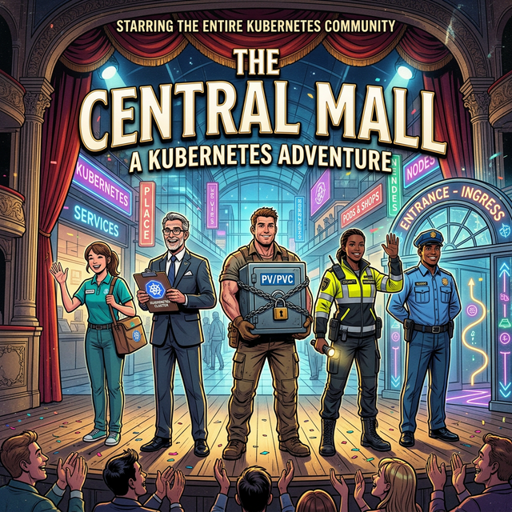

# 🖼️ Comic: The Cast of Characters
## Chapter 00: Introduction – The Mall Staff

> *Before the mall opens, let's meet everyone who keeps it running.*

This is an **introductory overview** of every character in *The Central Mall*, a living guide to the Kubernetes ecosystem through the eyes of a bustling urban mall.

---

## 🏗️ Management & Infrastructure

| Character | Kubernetes Concept | Role |
| :--- | :--- | :--- |
| 🏢 **The Central Management Office** | `kube-apiserver` | The single source of truth. Every request to change the mall must pass through this office. |
| 📖 **The Mall Ledger** | Kubernetes API | The official record of every shop, worker, and rule. If it isn't in the Ledger, it doesn't exist. |
| 🏦 **The Mall Building / Wing** | Node | A physical machine that provides CPU, memory, and networking. Pods run *inside* a Node. |
| 🛂 **The Owner's ID Badge** | `kubeconfig` | Your digital master key. Proves who you are and which parts of the Management Office you can access. |

---

## 🧑‍💼 Staff & Workers

| Character | Kubernetes Concept | Role |
| :--- | :--- | :--- |
| 👷 **The Shop Clerk** | Pod | The individual running application, the heartbeat of the mall. |
| 🗂️ **The Store Manager** | Deployment | Ensures the correct number of Shop Clerks are always at their desks. |
| 🔁 **The Timed Event Crew** | Job / CronJob | Hired for a specific task (stocktake, cleanup). When done, they leave. CronJobs show up on schedule. |
| 🛡️ **The Floor Security Guard** | DaemonSet | Ensures *one guard per floor (Node)*, covering every part of the mall, always. |
| 🚪 **The Trophy Boutique** | StatefulSet | A fixed storefront with a permanent address. The right choice for stateful apps like databases. |

---

## 📦 Storage

| Character | Kubernetes Concept | Role |
| :--- | :--- | :--- |
| 🗄️ **The Shift Workspace** | `emptyDir` | A locker shared between workers within *one shop* (Pod). Emptied when the shop closes. |
| 🔐 **The Permanent Vault** | PersistentVolume / PVC | A storage unit in the basement. Stays locked and filled even if the worker is replaced. |

---

## 🔐 Security & Identity

| Character | Kubernetes Concept | Role |
| :--- | :--- | :--- |
| 🪪 **The Automated Employee ID** | ServiceAccount | The identity worn by every Pod to authenticate with Management. |
| 📋 **The Local Shop Permit** | Role | A "Can-Do" list restricted to a *single shop (Namespace)*. |
| 📝 **The Local HR Appointment** | RoleBinding | The document that assigns a Local Permit to a specific Employee ID. |
| 🌐 **The Mall-Wide Authority** | ClusterRole | Rules that apply to the *entire mall (Cluster)*. |
| 🏅 **The Mall-Wide Appointment** | ClusterRoleBinding | Grants a Mall-Wide Authority to an ID, a big promotion. |
| 🚦 **The Entry Permit Desk** | Admission Controller | Reviews every request entering the mall. Can approve, modify, or reject it before it's recorded. |
| 🦺 **The Safety Rulebook** | SecurityContext | Defines what tools and keys a worker is allowed to carry on the job. |

---

## 🌐 Networking & Routing

| Character | Kubernetes Concept | Role |
| :--- | :--- | :--- |
| 🪧 **The Permanent Storefront Sign** | Service (ClusterIP) | A stable internal address. Even if workers change, the counter stays put. |
| 🚪 **The Side Entrance with Keypad** | Service (NodePort) | A high-port external entry point on every building, for testing or direct access. |
| 🚦 **The Guard at the Main Entrance** | Ingress Controller | Reads the Ingress Rules and directs external traffic into the mall. |
| 📋 **The Guard's Rule Sheet** | Ingress Resource | A single file listing routing rules for every store. |
| 🏗️ **The Mall Construction Plan** | GatewayClass | Defines the technology used for the gateway (Nginx, Istio, Cloud). Set by the provider. |
| 🏛️ **The Physical Transit Hub** | Gateway | The actual entrance with an IP address, managed by Admins. |
| 🗺️ **The Store-Specific Directions** | HTTPRoute | Fine-grained routing rules created by App Developers. |

---

## ⚙️ Configuration & Automation

| Character | Kubernetes Concept | Role |
| :--- | :--- | :--- |
| 📌 **The Rulebook (Price List)** | ConfigMap | Non-sensitive settings injected into containers. |
| 🔑 **The Vault Combination** | Secret | Sensitive data (passwords, tokens) stored encrypted. |
| 📜 **The Special Permit** | CRD | Extends the Kubernetes API with new custom object types. |
| 🤖 **The Robotic Architect** | Operator | Watches Custom Resources and automatically manages complex application lifecycles. |

---

> 🛍️ *Now that you know the full cast, let's open the mall!*

---

## 🔗 References
- **Story Index** → [The Central Mall: A CKAD Adventure](../../../../sources/story.md)
- **Reference** → [Full Cast of Characters](../../../../reference/md-resources/cast-of-characters.md)
- **Comics Registry** → [All Comics](../../README.md)
