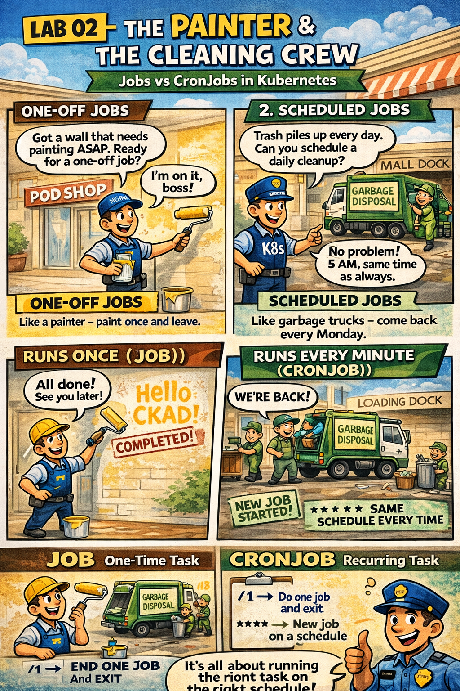

# 🖌️ The Painter & The Cleaning Crew

This comic explains:
- The difference between **Deployments** (Services) and **Jobs** (Tasks)
- How **CronJobs** schedule recurring work
- How Kubernetes handles task completion and failures

📌 Read this if:
- You are working on **[LAB 02](../../../../practice/labs/ch01-workloads/lab02-jobs-cronjobs/README.md)**.
- You want to understand **Batch Processing & Scheduling**
- You want a quick **mental model** using the mall analogy 😄

🔗 References:
- Docs → [Kubernetes Docs: Jobs](https://kubernetes.io/docs/concepts/workloads/controllers/job/)
- Lab → [`practice/labs/ch01-workloads/lab02-jobs-cronjobs`](../../../../practice/labs/ch01-workloads/lab02-jobs-cronjobs/README.md)

---

# 📖 Comic Script (Text Version)

*> **Scene 1:** Not everyone works 9-to-5. Some tasks are one-off or scheduled.*

---

### Frame 1: The Standard Worker (Deployment)
**Manager (K8s):** "Hey Receptionist! Are you at your desk?"
**Receptionist (Pod):** "Always! 24/7! I never leave!"
**Manager:** "Good. That’s a **Deployment**."

---

### Frame 2: The One-Off Task (Job)
**Manager:** "The wall looks dirty. I need a **Painter**."
**Painter (Job Pod):** "I’m here!"
**Manager:** "Paint the wall, then go home."
**Painter:** "On it!"
*(Painter paints the wall)* 🖌️
**Painter:** "Done! I’m leaving."
*(Painter exits successfully: `Completed`)*

---

### Frame 3: What if it fails?
**Painter 2:** "I tried to paint but I spilled the bucket!" (Crash)
**Manager:** "No worries. **Restart Policy: OnFailure**. Try again."
**Painter 3:** "Okay, done this time!"
*(Manager marks task as `1/1 Succeeded`)*

---

### Frame 4: The Scheduled Crew (CronJob)
**Manager:** "The mall gets dirty every night. I can't call a cleaner manually every day."
**Manager:** "I’ll set a **Schedule: '0 2 * * *'** (2 AM everyday)."

*(Clock strikes 2 AM)* 🕑
**Cleaner (CronJob Pod):** "Time to clean!"
*(Cleaner works and leaves)*

*(Next day, 2 AM)* 🕑
**Cleaner:** "Here I go again!"

---

> **Key Takeaway:**
> - **Deployment**: Always running web servers.
> - **Job**: Run once to completion (Batch task).
> - **CronJob**: Run on a time schedule (Backup, Report).

---

## 🔗 References
- Chapter → [Chapter 1: Workloads & Contracts](../../../../sources/study-guide/ch01-workloads.md)
