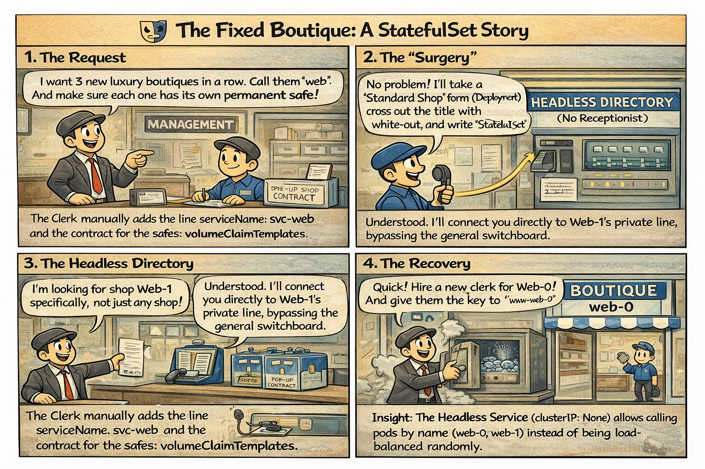

# 🎭 The Fixed Boutique: A StatefulSet Story

This comic explains why **StatefulSets** are the "VIPs" of the Kubernetes world and why their identity is tied to both their name and their "Warehouse Safe" (Volume).

---

## 🛍️ Mall Analogy

- **Boutique Row (StatefulSet)** → Unlike standard kiosks, these stores have a fixed address and a permanent reputation.
- **The Name is the Address (Ordinals)** → If boutique `web-0` closes, it *must* reopen as `web-0`. It cannot be renamed or replaced by a random number.
- **The Personal Safe (Persistent Volumes)** → Every owner has a key to a specific safe in the basement. If the owner of `web-1` leaves, the successor inherits the `web-1` safe, not a random one.
- **Private Line (Headless Service)** → Customers can call a specific boutique directly (e.g., "Web-1") instead of going through a general switchboard that sends them to any random shop.

> 🛍️ *In Boutique Row, your name is your destiny—and your safe stays with you.*

---

## 🧠 Key Takeaways

- **Stable Identity:** Pods in a StatefulSet have a persistent hostname (`name-0`, `name-1`) that remains the same across restarts.
- **Ordered Deployment:** Pods are started, updated, and deleted in a strict order (usually 0 to N-1).
- **Headless Service:** A `clusterIP: None` service is required to provide DNS entries for each individual Pod.
- **CKAD Tip:** When using `volumeClaimTemplates` in a StatefulSet, Kubernetes automatically creates a unique PVC for each Pod that persists even if the Pod is deleted.

---

## 🔗 References
- **Study Guide** → [Chapter 1: Workloads & Contracts](../../../../sources/study-guide/ch01-workloads.md)
- **Lab** → [The Fixed Boutique (StatefulSets)](../../../../practice/labs/ch01-workloads/lab02-statefulsets/README.md)
- **Docs** → [Using StatefulSets](../../../../reference/md-resources/using-statefulsets.md)