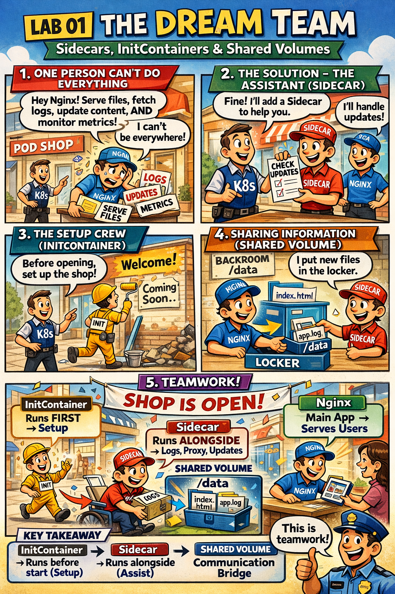

# 🖼️ Comic: The Sidecar Assistant
## Chapter 02: Multi-Container – Design Patterns

This comic explains how **Multi-Container Pods** work and how they share resources to accomplish a single goal.

---

## 🛍️ Mall Analogy

- **The Main Shop Clerk (Nginx)** → The primary worker who serves customers (traffic).
- **The Specialized Assistant (Sidecar)** → A helper who performs background tasks like fetching new inventory or sorting logs.
- **The Renovation Crew (InitContainer)** → Workers who arrive *before* the shop opens to paint the walls. They leave once the job is done, allowing the clerks to enter.
- **The Shared Locker (Volume)** → A common space where the clerk and the assistant can exchange files or data.

> 🛍️ *Init workers build the shop; Sidecars help manage it.*

---

## 🧠 Key Takeaways

- **Atomic Life:** All containers in a Pod are scheduled, started, and stopped together on the same Node.
- **Shared Network & Storage:** Containers in the same Pod share the same IP address (localhost) and can share local disk space via Volumes.
- **Lifecycle:** InitContainers must finish successfully before the main containers start. Sidecars run for the entire duration of the Pod's life.
- **CKAD Tip:** When troubleshooting a multi-container Pod, remember to specify the container name: `kubectl logs <pod-name> -c <container-name>`.

---

## 🔗 References
- **Study Guide** → [Chapter 2: Sidecars & Helpers](../../../../sources/study-guide/ch02-multi-container.md)
- **Lab** → [Lab 01 - Sidecar Pattern](../../../../practice/labs/ch02-multi-container/lab01-sidecar-pattern/README.md)
- **Docs** → [Decoupling Pods](../../../../reference/md-resources/decoupling-pods.md)
