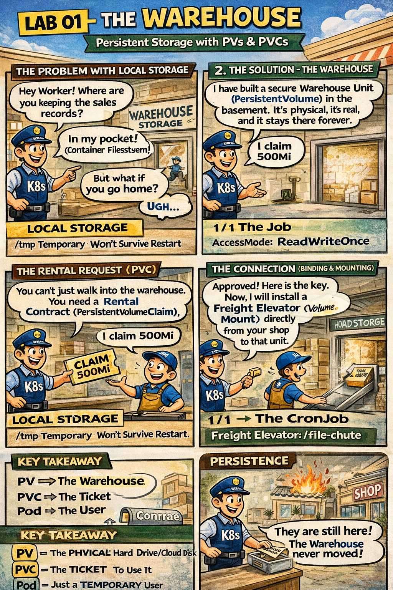

# 📦 The Warehouse & The Rental Contract

This comic explains how **Persistent Storage** allows data to survive even if the shop (Pod) shuts down or moves to a new building.

---

## 🛍️ Mall Analogy

- **In-Pocket Storage (Ephemeral)** → Keeping records in your apron. If you go home (Pod restart), the records are lost forever.
- **The Warehouse (PersistentVolume)** → A concrete storage unit in the mall's basement. It's a real, physical space that exists regardless of who is using it.
- **The Rental Contract (PersistentVolumeClaim)** → A request from a shop owner for a specific amount of space (e.g., 500Mi) with specific rules (e.g., "only I can use it").
- **The Freight Elevator (Volume Mount)** → The connection that allows a shop to drop files directly into their secured warehouse unit.

> 🛍️ *The Warehouse stays; only the clerks come and go.*

---

## 🧠 Key Takeaways

- **Decoupling:** Storage (PV) is managed separately from the compute (Pods). This allows data to persist independently of the Pod lifecycle.
- **Binding:** A **PVC** "claims" a **PV**. Once bound, that piece of storage is reserved for that specific claim.
- **Access Modes:** `ReadWriteOnce` means only one Node can use the storage at a time; `ReadWriteMany` allows multiple shops to share the same unit.
- **CKAD Tip:** When creating a PVC, the `accessModes` and `resources.requests.storage` must match (or be less than) what the available PV offers.

---

## 🔗 References
- **Lab** → [The Warehouse (PV/PVC)](../../../../practice/labs/ch02-multi-container/lab02-pv-pvc/README.md)
- **Docs** → [Creating a PersistentVolume](../../../../reference/md-resources/creating-a-persistentvolume.md)
- **Study Guide** → [Chapter 2: Sidecars & Helpers](../../../../sources/study-guide/ch02-multi-container.md)
