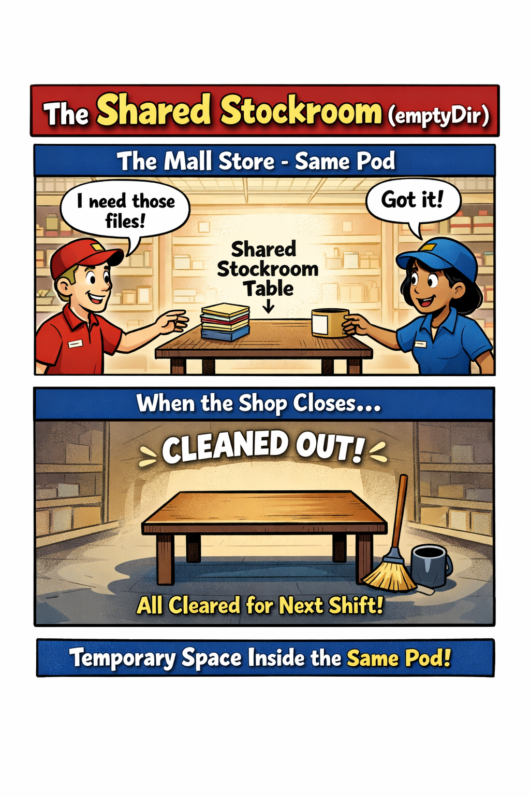

# 🖼️ Comic 03: The Shared Stockroom (emptyDir)
*Analogous to: Inter-container communication within a single Pod*

## 🛍️ The Analogy
Inside **The Mall Store**, space is tight. When two workers (Containers) need to pass items to each other, they don't walk outside. Instead, they use a **Shared Stockroom** table situated right between them.

- **The Workers (Containers)**: They live in the same shop (Pod).
- **The Table (emptyDir)**: A temporary surface provided by the mall. Both workers can reach it easily.
- **The Cleanup**: Just like a temporary workspace, when the shop closes (the Pod finishes or is deleted), the table is cleared of all items. Nothing persists for the next shift.

---

## 🔗 References
- [Study Guide](./../../sources/study-guide/ch02-multi-container.md)
- [Lab 03: Shared Volumes (emptyDir)](../../practice/labs/ch02-multi-container/lab03-shared-volumes-empty-dir/README.md)
