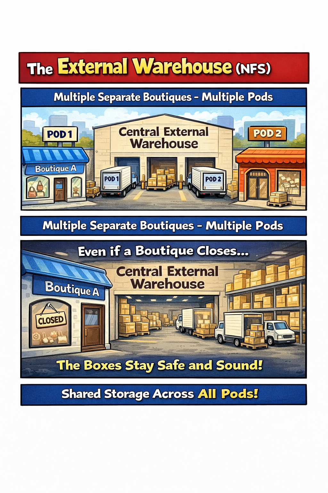

# 🖼️ Comic 04: The External Warehouse (NFS)
*Analogous to: Persistent, multi-pod network storage*

## 🛍️ The Analogy
When your inventory becomes too large or needs to be shared across many different shops, you move it to the **Central External Warehouse**.

- **The Boutiques (Pods)**: Multiple separate shops (Pod 1, Pod 2) that are not in the same building.
- **The Warehouse (NFS Server)**: A permanent, external facility located outside the boutiques.
- **The Delivery Paths (ReadWriteMany)**: Because the warehouse is external, multiple boutiques can send their trucks to the **same** loading docks at the same time.
- **Persistence**: Even if Boutique A closes or moves to a new location, the boxes in the External Warehouse remain exactly where they were, safe and sound.

---
[Back to Chapter 2 Comics](../README.md)
