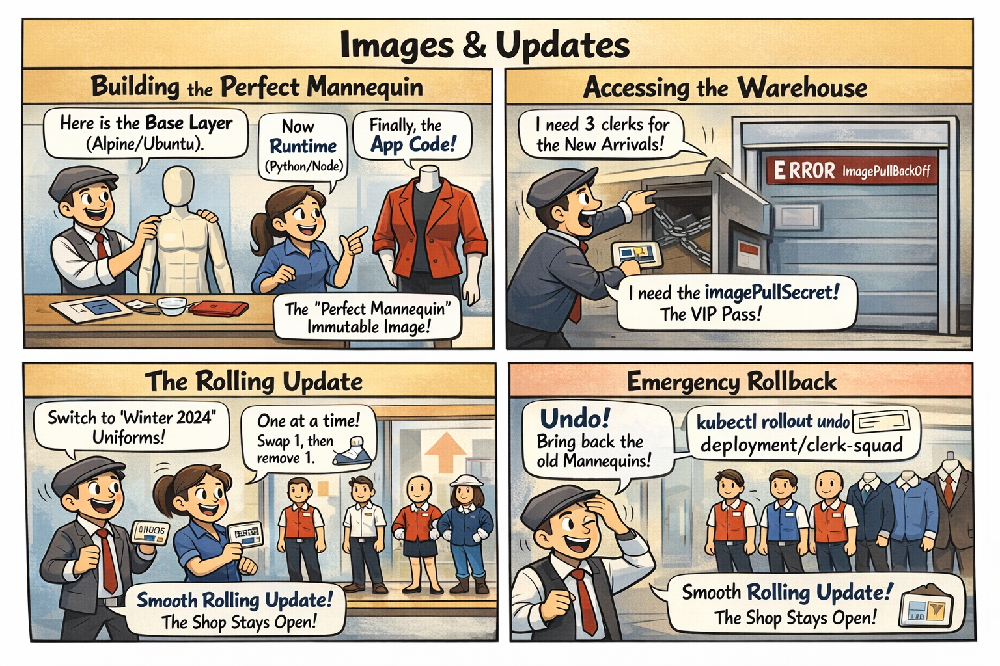

# 🎭 The Perfect Mannequin

This comic explains how **Container Images** are built and how **Rolling Updates** ensure the mall stays fresh without closing its doors.

---

## 🛍️ Mall Analogy

- **The Mannequin (Container Image)** → An immutable display model. We don't repaint it while it's in the window; we order a new one from the factory.
- **Layers** → Building the mannequin: start with a plastic base (Base Image), add the internal mechanics (Runtime), and finally the uniform (App Code).
- **The Factory Warehouse (Registry)** → Where all mannequin models are stored. You need a **VIP Pass (imagePullSecret)** to get the exclusive models.
- **Rolling Update** → Swapping mannequins one at a time. Customers never see an empty display because there's always at least one model standing.
- **The Rollback** → Reaching into the backroom to bring back last season's model because the new one turned out to be broken.

> 🛍️ *Don't fix the mannequin; replace it with a better version.*

---

## 🧠 Key Takeaways

- **Immutability:** Once an image is "tagged" and stored, it should never change. Updates involve creating a new version of the image.
- **Rolling Update:** The default strategy for Deployments. It gradually replaces old Pods with new ones, maintaining availability.
- **ImagePullPolicy:** `Always` ensures you always get the latest version from the factory; `IfNotPresent` saves time by using what's already in the backroom.
- **CKAD Tip:** Use `kubectl rollout history` to see previous versions and `kubectl rollout undo` to quickly revert a failed update.

---

## 🔗 References
- **Study Guide** → [Chapter 3: Pod Design & Images](../../../../sources/study-guide/ch03-pod-design.md)
- **Lab** → [Build Container from Scratch](../../../../practice/labs/ch03-images/lab01-build-container-from-scratch/README.md)
- **Lab** → [Image Updates & Rollouts](../../../../practice/labs/ch03-images/lab03-image-updates/README.md)
- **Docs** → [Managing Images & Rollouts](../../../../reference/md-resources/managing-container-images-and-rollouts.md)
