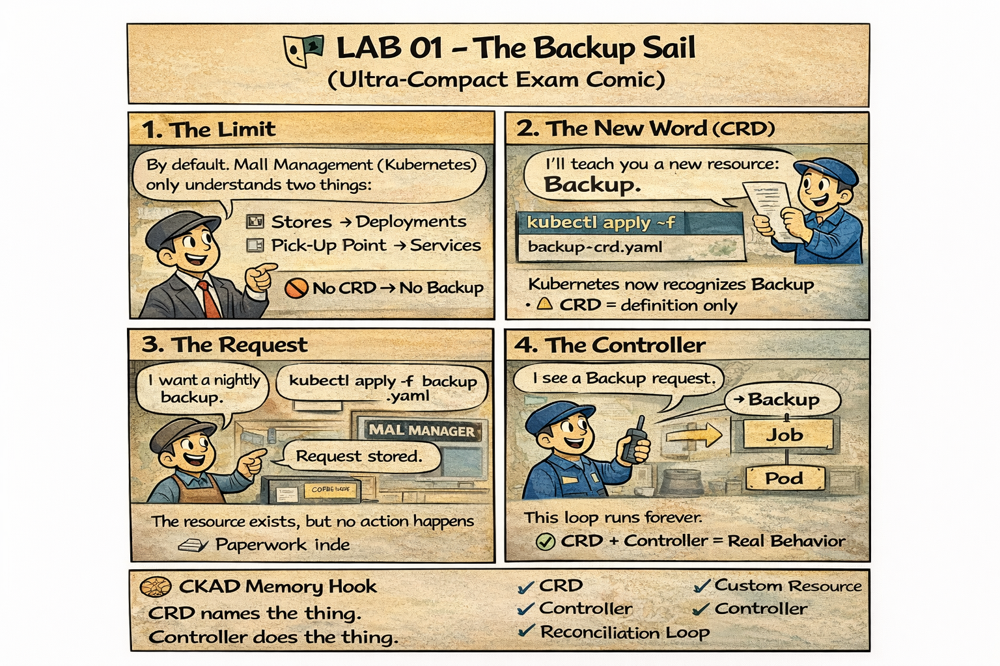

# 🖼️ Comic: The Nightly Backup Permit
## Chapter 04: Extending – Custom Resource Definitions

This comic explains how **Custom Resource Definitions (CRDs)** and **Operators** extend the mall's capabilities beyond standard building rules.

---

## 🛍️ Mall Analogy

- **Mall Ledger (API Server)** → The official book of mall rules and records.
- **Custom Permit (CRD)** → Teaching the Mall Manager a new concept, like "Nightly Backup". Without this permit, the Manager doesn't even know what a "Backup" is.
- **Special Permit Form (Custom Resource)** → A shop owner fills out this new form to request a backup.
- **External Contractor (Operator/Controller)** → A specialized worker who watches the Ledger. When they see a "Backup" form, they are the ones who actually go and do the job.

> 🛍️ *Permits record the intent; Contractors perform the action.*

---

## 🧠 Key Takeaways

- **Extension:** CRDs allow you to extend the Kubernetes API with any resource type you need.
- **Model vs Action:** Creating a CRD only defines a "word"; you still need a **Controller** to make it do something.
- **Desired vs Actual:** The **Reconciliation Loop** is the Controller's "brain" that keeps checking the Ledger to see if it needs to act.
- **CKAD Tip:** In the exam, you may need to interact with CRDs. Remember that they behave like built-in resources once defined.

---

## 🔗 References
- **Study Guide** → [Chapter 4: Extending the Mall](../../../../sources/study-guide/ch04-extending-k8s.md)
- **Lab** → [Lab 01 - Shopping Items CRD](../../../../practice/labs/ch04-extending/lab01-crd-install/README.md)
- **Docs** → [Extending K8s with CRDs](../../../../reference/md-resources/extending-k8s-crds-operators.md)

---
[Mall Directory ✨](../../../../GLOSSARY.md)
