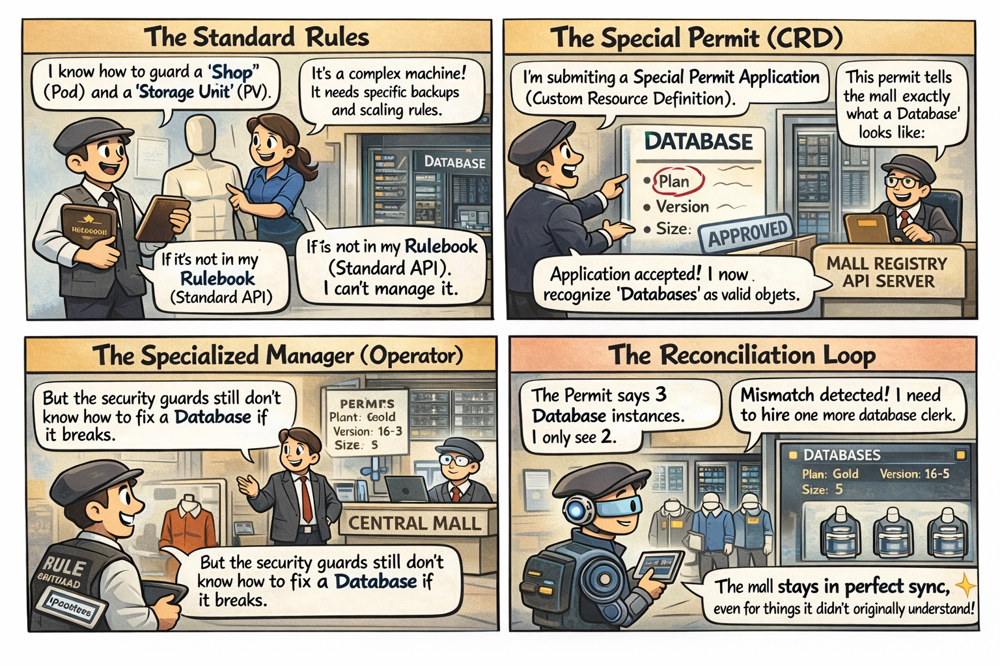

# 🖼️ Comic: The Manager with the Manual
## Chapter 04: Extending – Operators

This comic explains why Kubernetes doesn't know what a "Database" is by default and how the **Operator Pattern** solves this.

---

## 🛍️ Mall Analogy

- **Standard Rulebook** → The Mall Manager knows how to guard a "Shop" (Pod) but is confused by complex things like high-tech "Server Farms" (Databases).
- **Special Permit (CRD)** → Teaching the mall new definitions. Once the permit is in the rulebook, the Mall Manager recognizes "Databases" as valid objects.
- **The Specialized Manager (Operator)** → A worker who has read the specific "Database Manual". They don't just stand guard; they know how to fix, backup, and scale that specific tech.
- **Reconciliation Loop** → The Operator's constant vigilance: "The permit says 3 clerks, but I only see 2. I need to hire one more."

> 🛍️ *Operators are managers who specialize in complex permits.*

---

## 🧠 Key Takeaways

- **Custom Resource Definitions (CRDs)** are the mechanism to extend the Kubernetes API.
- **Operators** implement the **Control Loop** pattern to manage the lifecycle of custom resources automatically.
- **Observability:** Operators constantly observe the actual state and perform actions to bring it in line with the desired state defined in the Custom Resource.
- **CKAD Tip:** Understand that Operators are often used for stateful applications (databases, message queues) that require more than just simple scaling.

---

## 🔗 References
- **Study Guide** → [Chapter 4: Extending the Mall](../../../../sources/study-guide/ch04-extending-k8s.md)
- **Lab** → [Lab 04 - CRDs & Operators](../../../../practice/labs/ch04-extending/lab04-operators-helm/README.md)
- **Docs** → [Understanding CRDs](../../../../reference/md-resources/understanding-custom-resource-definitions-crds.md)

---
[Mall Directory ✨](../../../../GLOSSARY.md)
