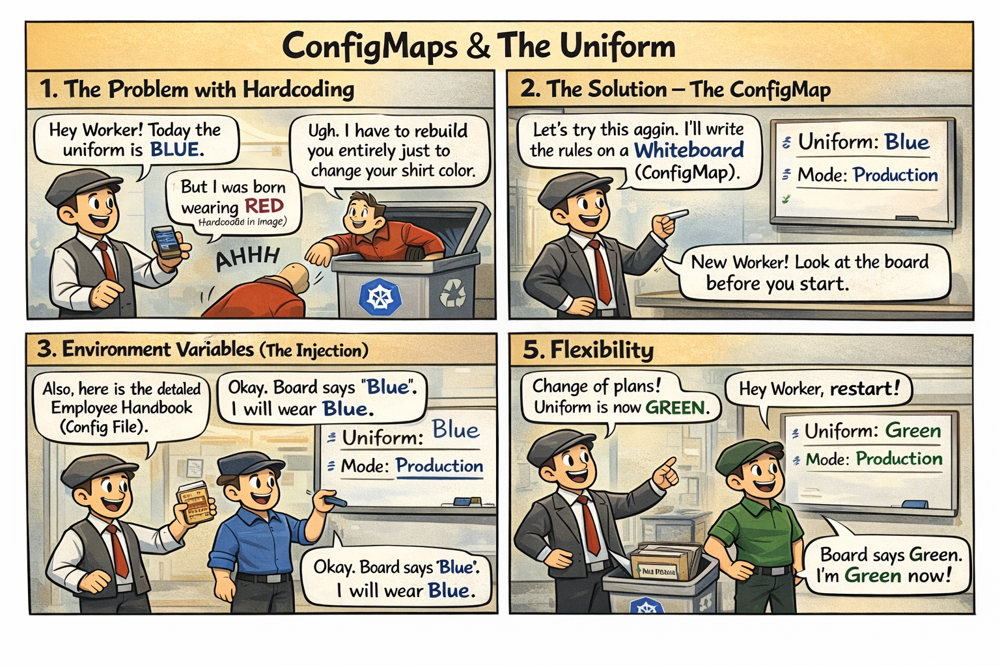

# 🖼️ Comic: The Rulebook & The Uniform
## Chapter 05: Configuration – ConfigMaps

This comic explains how to **decouple configuration** from your store's workers so you can change rules without rehiring everyone.

---

## 🛍️ Mall Analogy

- **Hardcoding Rules** → Training a worker to only wear red. If the uniform changes to blue, you have to fire them and hire a new one (Rebuilding the Image).
- **The Whiteboard (ConfigMap)** → A central board where the Manager writes current rules like `ShirtColor: Blue`.
- **Injection (Env Vars)** → A worker looks at the whiteboard *once* before starting their shift to see what shirt to wear.
- **The Manual (Volume Mount)** → A detailed handbook kept in the worker's pocket. If the Manager updates the whiteboard, the worker can check the manual for new instructions without leaving their post.

> 🛍️ *Write your rules on the whiteboard, not in the worker's brain.*

---

## 🧠 Key Takeaways

- **Decoupling:** ConfigMaps allow you to change an application's behavior across different environments (Dev, Prod) without changing the code or image.
- **Environment Variables:** Best for simple, single values. They are usually set when the container starts.
- **Volume Mounts:** Best for entire configuration files. They allow the application to read rules from a specific directory path.
- **CKAD Tip:** Know how to create a ConfigMap from a literal (`--from-literal`) or from a file (`--from-file`) using `kubectl`.

---

## 🔗 References
- **Study Guide** → [Chapter 5: Configuration](../../../../sources/study-guide/ch05-configuration.md)
- **Lab** → [Lab 01 - ConfigMaps](../../../../practice/labs/ch05-config-secrets/lab01-configmap-rulebook/README.md)
- **Docs** → [Configuration Decoupling](../../../../reference/md-resources/configuration-decoupling.md)

---
[Mall Directory ✨](../../../../GLOSSARY.md)
