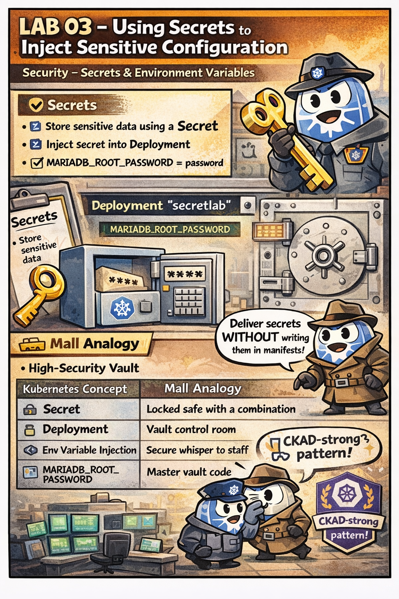

# 🕵️ The Secret of the High-Security Vault

This comic explains how to handle **sensitive data** in Kubernetes without leaking it to the public.

---

## 🛍️ Mall Analogy

- **Plain Whiteboard (ConfigMap)** → Anyone walking by can read the rules written here. Not for passwords!
- **High-Security Vault (Secrets)** → A locked box in the Manager's office. The contents are obscured (Encoded) and only revealed to authorized staff.
- **The Delivery (Injection)** → A worker receives the password *directly* from the vault into their hand (Env Var) or a locked envelope in their pocket (Volume) just before they start their task.

> 🛍️ *Locks only keep honest people out; Secrets keep your passwords from the public whiteboard.*

---

## 🧠 Key Takeaways

- **Security:** Secrets are similar to ConfigMaps but are intended for sensitive data like passwords, tokens, or keys.
- **Encoding:** By default, Secrets are stored as Base64 strings. This is *not* encryption, but it prevents accidental exposure in YAML files.
- **Access Control:** You can limit which workers (ServiceAccounts) have the authority to open specific vaults (Secrets).
- **CKAD Tip:** When creating a secret from the CLI, use `kubectl create secret generic <name> --from-literal=password=12345`. Kubernetes handles the Base64 encoding for you.

---

## 🔗 References
- **Study Guide** → [Chapter 5: Configuration](../../../../sources/study-guide/ch05-configuration.md)
- **Lab** → [Secrets Injection](../../../../practice/labs/ch05-config-secrets/lab03-secrets-env-injection/README.md)
- **Docs** → [Secrets & Security](../../../../reference/md-resources/core-concepts-configmaps-secrets-and-security.md)
