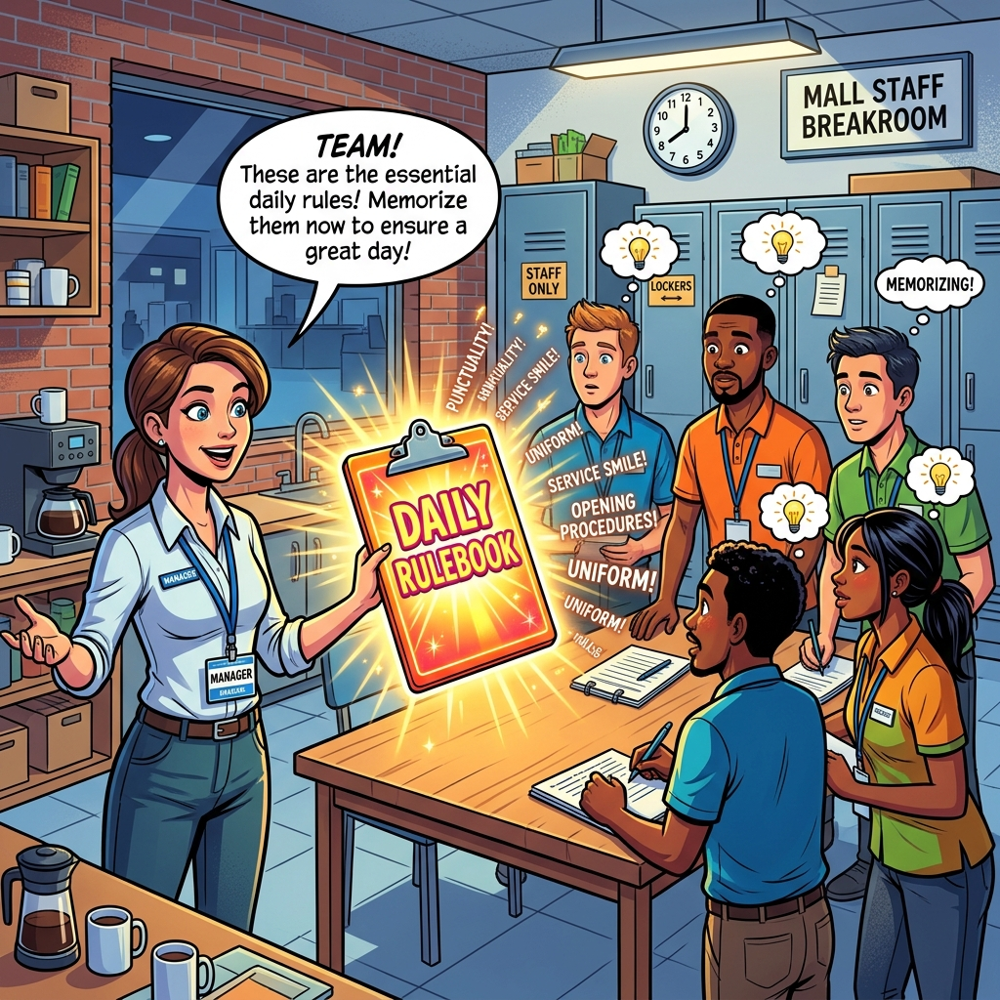

# 🖼️ Comic: The Morning Briefing
## Chapter 05: Configuration – ConfigMaps with envFrom

This comic explains how to **inject all rules at once** using `envFrom` so you don't have to list each instruction individually.

---

## 🛍️ Mall Analogy

- **Selectively Telling Rules (env)** → A Manager reading from the clipboard and telling the clerk: "Rule 1 is wear blue. Rule 2 is smile." It takes a long time (more YAML).
- **The Morning Briefing (envFrom)** → The Manager hands over the entire clipboard to the workers and says "Memorize everything on this list right now before your shift starts!" The workers instantly memorize all the keys as Environment Variables.

> 🛍️ *Don't recite every rule if they need to know all of them. Just hand them the list.*

---

## 🧠 Key Takeaways

- **envFrom:** Use this attribute to pull *every* key-value pair from a ConfigMap (or Secret) and expose them natively as environment variables inside the container.
- **Save YAML typing:** Useful if a specific application (like a Spring Boot or Node.js app) was written to look for 20 different environment variables. Instead of 20 `env` blocks, you use a single `envFrom`.

---

## 🔗 References
- **Study Guide** → [Chapter 5: Configuration](../../../../sources/study-guide/ch05-configuration.md)
- **Lab** → [Lab 06 - ConfigMap envFrom](../../../../practice/labs/ch05-config-secrets/lab06-configmap-envfrom/README.md)
