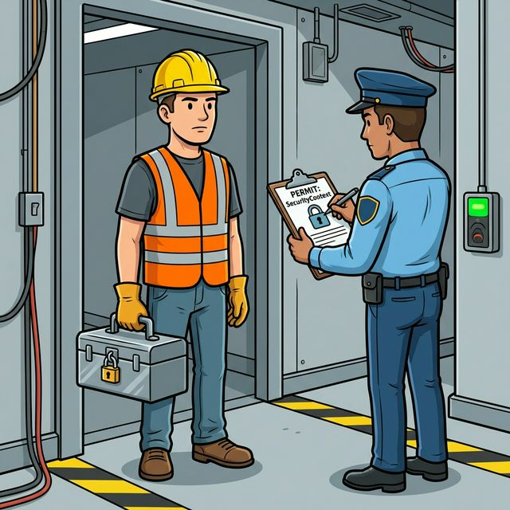

# 🖼️ Comic: Worker Safety
## Chapter 06: Safety – SecurityContext

This comic explains **SecurityContexts & Capabilities** using the *Central Mall* analogy. In a large mall, some maintenance requires specialized tools. If every clerk had a master key and a chainsaw, the mall wouldn't be very safe.

---

## 🛍️ Mall Analogy

- **The Master Key (Privileged)** → Giving a worker the power to open *every* door in the mall and even change the building’s structure. Dangerous and rarely allowed!
- **Employee Identification (RunAsUser)** → Ensuring the worker doesn't secretly pretend to be the Mall Manager (root) when they are just supposed to be a shoe salesman.
- **Specific Permits (Capabilities)** → Instead of a master key, we give the worker a specific tool—like a wire-cutter (`NET_ADMIN`)—and only for the duration of the job.
- **Confiscating Tools (Drop: ALL)** → Taking away a worker's entire toolbox at the entrance and only giving them back the *one* wrench they actually need.

> 🛍️ *Trust, but verify. A clerk selling shoes doesn't need the keys to the boiler room.*

---

## 🧠 Key Takeaways

- **Least Privilege:** Only give containers the specific permissions they need to run. Use `allowPrivilegeEscalation: false` to prevent them from "finding" more keys.
- **Pod vs. Container:** `SecurityContext` can be set for the whole Pod (defaults) or specifically for one Container (overrides).
- **UID/GID:** controls what files the process can read/write based on standard Linux permissions.
- **CKAD Tip:** Most security questions will ask you to set `runAsUser` or `capabilities`. Remember that `capabilities` are set at the **container** level, not the Pod level.

---

## 🔗 References
- **Study Guide** → [Chapter 6: Safety & Conduct](../../../../sources/study-guide/ch06-security.md)
- **Lab** → [Lab 01 - Worker Safety (SecurityContext)](../../../../practice/labs/ch06-safety/lab01-serviceaccount-identity/README.md)
- **Docs** → [Worker Safety and Conduct](../../../../reference/md-resources/securitycontext-worker-safety-and-conduct.md)
