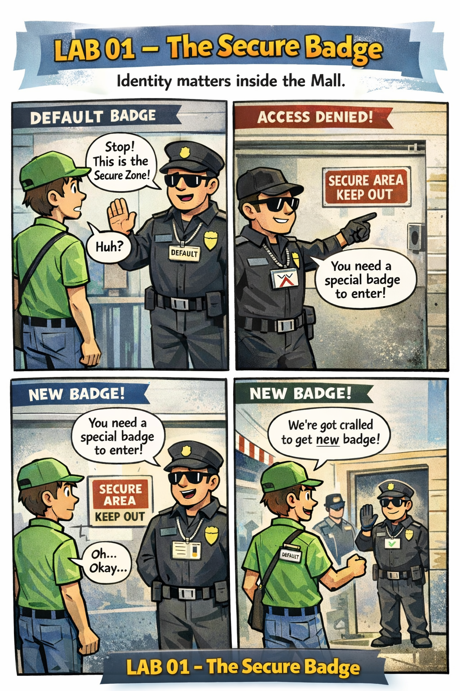

# 🖼️ Comic: The Secure Badge
## Chapter 07: Identity – ServiceAccounts

This comic explains **how identity works in Kubernetes** using the *Central Mall* analogy. Every Pod enters the cluster wearing a **badge**, which determines **what it is allowed to do**.

---

## 🛍️ Mall Analogy

- **ServiceAccounts** → The magnetic ID badges issued to staff.
- **Default Badge** → The generic visitor pass everyone gets unless specified otherwise.
- **HR Department (Deployments)** → Decides which badge a new hire receives.
- **Security Gates** → Check the badge (not the person) to grant access.

> 🛍️ *Pods don’t ask for access, they wear the badge they’re given.*

---

## 🧠 Key Takeaways

- **Identity first:** Every Pod always has a ServiceAccount identity.
- **Inheritance:** Pods inherit their identity at creation time; they cannot change badges mid-shift.
- **Security Boundary:** Permissions are attached to the badge, making ServiceAccounts a critical security layer.
- **CKAD Tip:** If a Pod is denied access, use `kubectl describe pod` to verify its `ServiceAccount` and ensure it has the correct permissions.

---

## 🔗 References
- **Study Guide** → [Chapter 7: Identity & RBAC](../../../../sources/study-guide/ch07-identity.md)
- **Lab** → [Lab 01 - ServiceAccount Identity](../../../../practice/labs/ch07-identity/lab01-serviceaccount-identity/README.md)
- **Docs** → [Understanding ServiceAccounts](../../../../reference/md-resources/understanding-serviceaccounts-the-shops-internal-badge.md)
