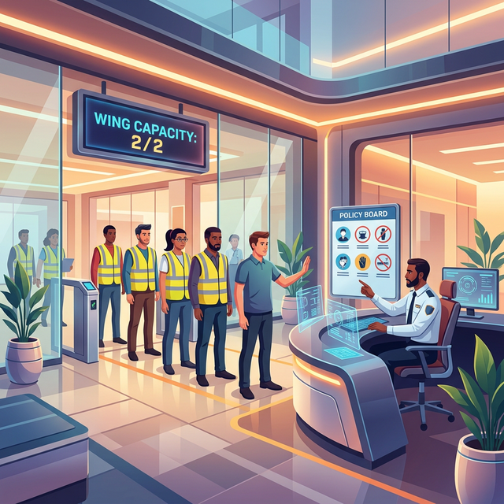

# 🏢 The Entry Permit Office: An Admission Control Story

Even with a badge and a job description, you might still be stopped at the gate. The **Entry Permit Office** is the final compliance checkpoint for every worker entering the **Central Mall**.

---

## 🛍️ Mall Analogy

- **The Entrance Gate (Admission Webhook)** → The point where every "Hire Worker" request is intercepted.
- **The Compliance Check (Validating)** → Ensuring the worker meets mall safety standards (e.g., "Are they wearing a resource-limit safety vest?").
- **The Auto-Correction (Mutating)** → If the worker forgot their standard uniform, the office might automatically put one on them before they enter.
- **The Wing Capacity (ResourceQuota)** → The office tracks how many people are in each mall wing. If the wing is full, no more permits are issued until someone leaves.

> 🏢 *The Mall Ledger says you're hired, but the Entry Office decides if you're safe to enter.*

---

## 🧠 Key Takeaways

- **Interception Point:** Admission Controllers intercept requests to the API server *after* authentication and authorization.
- **Policy Enforcement:** Use them to enforce security standards, resource limits, and best practices across the cluster.
- **Two Phases:**
  1. **Mutating Phase:** Modifies the request (e.g., adding default storage classes or sidecars).
  2. **Validating Phase:** Rejects or accepts the request based on rules.
- **CKAD Tip:** ResourceQuotas and LimitRanges are the most common "built-in" admission controllers you'll interact with during the exam.

---

## 🔗 References
- **Study Guide** → [Chapter 7: Identity & Access](../../../../sources/study-guide/ch07-identity.md)
- **Lab** → [The Entry Permit Office (Admission Control)](../../../../practice/labs/ch07-identity/lab03-admission-control-entry-permit/README.md)
- **Docs** → [The Cast of Characters](../../../../reference/md-resources/cast-of-characters.md)
