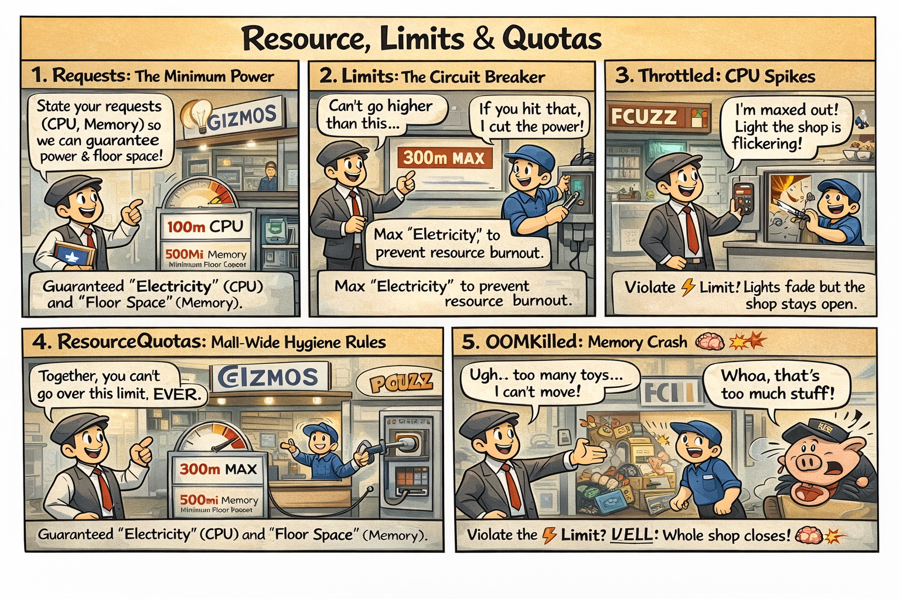

# 🐷 The Resource Hog

This comic explains **Resource Management (Requests & Limits)** using the *Central Mall* analogy. In a busy mall, electricity and water are shared. If one shop uses too much ground-resources, everyone suffers.

---

## 🛍️ Mall Analogy

- **Requests = Guaranteed Minimum:** The amount of electricity (CPU) and floor space (Memory) the Mall Manager reserves for you.
- **Limits = Circuit Breaker:** The maximum you are allowed to use before management steps in.
- **CPU Throttling:** If you exceed electricity limits, the Mall Manager dims your lights (slows you down) but doesn't kick you out.
- **Memory (OOMKilled):** If you try to cram too much inventory into a tiny stall, it collapses and is shut down immediately.

> 🛍️ *Don't be a hog! State your needs and respect your limits.*

---

## 🧠 Key Takeaways

- **Resource Requests** are for **Scheduling**: Finding a building (Node) with enough room for your minimum needs.
- **Resource Limits** are for **Safety**: Keeping the cluster stable by preventing single "hogs" from starving others.
- **CPU (Compressible):** Throttled when over limit (slow but alive).
- **Memory (Incompressible):** Terminated when over limit (`OOMKilled`).
- **CKAD Tip:** Define resources inside the **container** spec. Use `kubectl top pod` to identify resource-heavy containers.

---

## 🔗 References
- **Study Guide** → [Chapter 8: Resource Budgets](../../../../sources/study-guide/ch08-resource-budgets.md)
- **Lab** → [Managing Resource Constraints](../../../../practice/labs/ch08-resources/lab01-managing-resource-constraints/README.md)
- **Docs** → [Resource Budget Guide](../../../../reference/md-resources/resource-requests-limits-and-quotas-the-resource-budget.md)
