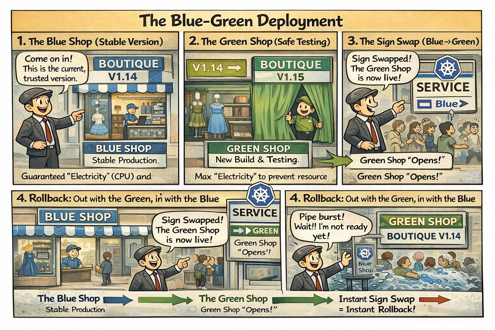

# 🔵🟢 The Sign Swap (Blue/Green Deployment)

This comic explains the **Blue/Green Strategy** using the *Central Mall* storefront analogy. Instead of changing a shop while customers are inside, we build a perfect replica next door.

---

## 🛍️ Mall Analogy

- **The Blue Shop** → The current, stable version of the store where customers are already shopping.
- **The Green Shop** → The new version of the store being built behind a curtain. It's fully functional but not yet open to the public.
- **The Sign Swap** → Moving the central entrance sign from the Blue shop to the Green shop. Instantly, all new customers enter the new version.
- **The Rollback** → If a pipe bursts in the Green Shop, we just move the sign back to the Blue Shop in seconds.

> 🛍️ *Why fix a shop with workers inside when you can just build a better one next door?*

---

## 🧠 Key Takeaways

- **Zero Downtime:** Traffic is flipped instantly from version A to version B once the new environment is verified.
- **Safe Testing:** The Green environment can be tested privately (using a separate internal service) before it goes live.
- **Resource Intensive:** This strategy requires double the cluster capacity, as both the old and new versions run at full scale simultaneously.
- **CKAD Tip:** A Blue/Green swap is performed at the **Service** level by updating the `selector` to point to the new Deployment's labels.

---

## 🔗 References
- **Lab** → [Blue/Green Traffic Transition](../../../../practice/labs/ch09-launch/lab04-blue-green-traffic-transition/README.md)
- **Docs** → [Implementing Blue/Green Deployments](../../../../reference/md-resources/implementing-bluegreen-deployments.md)
- **Study Guide** → [Chapter 9: Launch Day](../../../../sources/study-guide/ch09-deployments.md)
