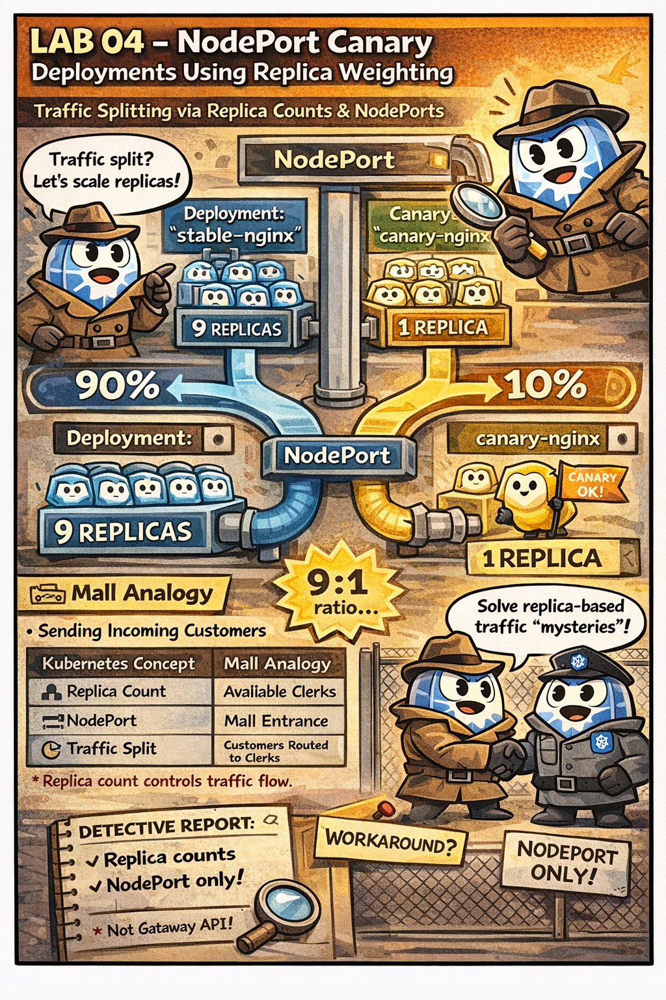

# 🖼️ Comic: The Canary Taste Test
## Chapter 09: Launch – Traffic Analysis

This comic explains how the **Canary Strategy** works when you only have a single entrance and no advanced traffic management tools.

---

## 🛍️ Mall Analogy

- **The Main Store (Stable)** → 10 clones of the current shop.
- **The New Concept (Canary)** → 1 clone of the new experimental shop.
- **The Single Entrance (Service)** → Customers walking through the front doors are randomly assigned to a shop.
- **The Math** → Since there are 10 old shops and only 1 new shop, only about 10% of customers will accidentally experience the new version.

> 🛍️ *Test the new waters with just one clerk before you hire a whole team.*

---

## 🧠 Key Takeaways

- **Traffic Splitting:** In a basic Kubernetes Service, traffic is split based on the number of Pods (replicas). If you have 9 old Pods and 1 new Pod, the traffic is roughly 90/10.
- **Risk Mitigation:** Canary allows you to test new features on a small subset of real traffic without risking the entire user base.
- **Simplicity:** This method doesn't require complex Ingress rules or Service Meshes; it's pure "replica math".
- **CKAD Tip:** To implement this, both the Stable and Canary Deployments must share the same label that the Service's `selector` uses.

---

## 🔗 References
- **Study Guide** → [Chapter 9: Launch Day](../../../../sources/study-guide/ch09-deployments.md)
- **Lab** → [Lab 04 - Canary Taste Test](../../../../practice/labs/ch09-launch/lab03-canary-wonderful/README.md)
- **Docs** → [Deployment Strategies Comparison](../../../../reference/md-resources/related-deployment-strategies-comparison.md)

---
[Mall Directory ✨](../../../../GLOSSARY.md) | [🔙 Back](javascript:history.back())
