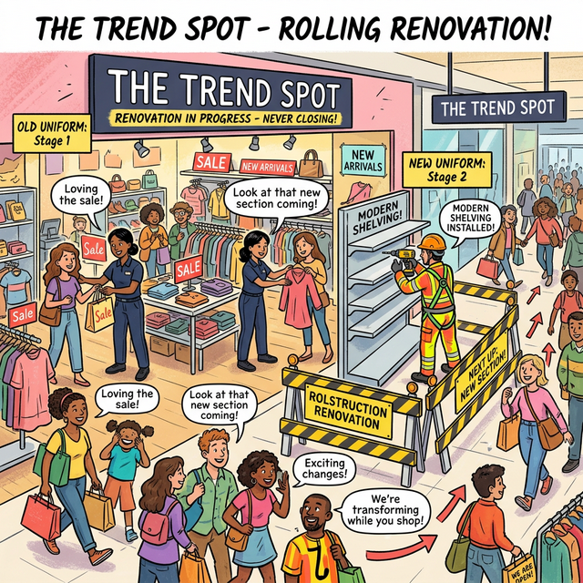

# �️ Comic: The Rolling Renovation
## Chapter 09: Launch – Rolling Updates

In the **Central Mall**, when a popular boutique like "The Trend Spot" needs a renovation, they can't afford to close their doors and lose revenue. Instead, they use a **Rolling Update** strategy.

The manager sets specific rules for the construction crew:
- **Max Surge (50%):** You are allowed to bring in extra temporary shelving and workers so that the store can actually operate at 150% capacity during the transition, ensuring no customer is turned away.
- **Max Unavailable (0%):** Under no circumstances can the number of active, open registers drop below the normal amount. The shop must always be fully available.

As a result, the crew replaces one section at a time, moving stock and staff from the old blue uniforms to the new neon ones, while customers seamlessly flow through the store, barely noticing the disruption!

---

## 🧠 Brain Connections

| Kubernetes Concept | Mall Analogy |
| :--- | :--- |
| **Old Repliset (v1)** | the workers in the classic blue uniforms |
| **New Repliset (v2)** | the workers in the experimental neon uniforms |
| **maxSurge** | the maximum number of extra staff/shelves allowed beyond the desired state during the update |
| **maxUnavailable** | the maximum number of unavailable instances the shop is allowed to have (here, 0 means no drop in service) |

---

## 🔗 Related Resources
- 🧪 **Practice Lab** → [Lab 01: The "Wonderful" Boutique Makeover](../../../../practice/labs/ch09-launch/lab01-rolling-update-wonderful/README.md)
- 📖 **Story/Theory** → [Chapter 9: Launch Strategies](../../../../sources/story/ch09-launch-strategies.md)
- 📝 **Study Guide** → [Chapter 9: Deployments](../../../../sources/study-guide/ch09-deployments.md)

---
[Mall Directory ✨](../../../../GLOSSARY.md)
