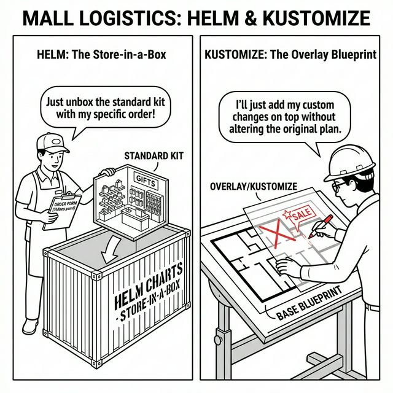

# 🎭 The Logistics Chain

This comic explains the difference between **Helm** and **Kustomize** using the Central Mall's logistics system.

---

## 🛍️ Mall Analogy

- **Store-in-a-Box (Helm)** → A shipping container that contains everything a new shop needs. You just fill out an order form (`values.yaml`) to specify colors and names, and the whole store is unboxed and ready.
- **The Overlay Blueprint (Kustomize)** → Instead of a new box, you take the original mall plan (Base) and place a transparent sheet of trace paper (Overlay) over it. You just draw the specific changes for your wing without touching the original plan.
- **Templating vs. Patching** → Helm builds the store from a kit; Kustomize adjusts the existing blueprint.

> 🛍️ *Unbox a complete kit with Helm, or customize your local blueprint with Kustomize.*

---

## 🧠 Key Takeaways

- **Helm:** A package manager that uses templates to generate YAML. Best for sharing complex applications and managing versions.
- **Kustomize:** A template-free way to customize YAML. It uses "patches" to merge environment-specific changes into a base configuration.
- **Integration:** Helm is often used for 3rd-party apps (e.g., Ingress Controllers), while Kustomize is built into `kubectl` and is great for maintaining your own simple environment variations (Dev, Staging, Prod).
- **CKAD Tip:** You don't need to be an expert in Helm for the exam, but you should know how to use `kubectl kustomize <dir>` or `kubectl apply -k <dir>`.

---

## 🔗 References
- **Lab** → [Helm & Kustomize](../../../../practice/labs/ch10-logistics/lab06-helm-packages/README.md)
- **Docs** → [Using Helm](../../../../reference/md-resources/using-the-helm-package-manager.md)
- **Study Guide** → [Chapter 10: Logistics Tools](../../../../sources/study-guide/ch10-logistics.md)
