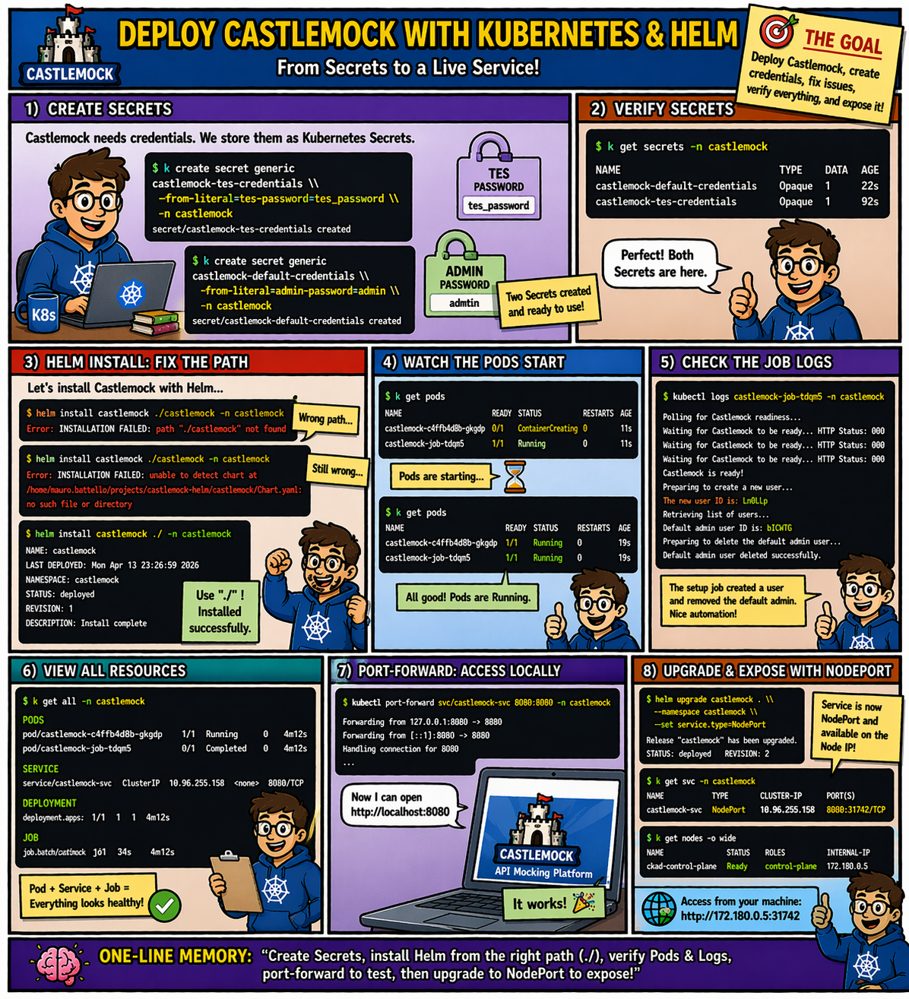

# 🎨 Comic 03: The Castlemock Grand Opening

Deploying an application with **Helm** is like ordering a pre-packed boutique for the mall. But a "Grand Opening" is more than just unpacking boxes, it's a ritual of preparation, automated setup, and scaling the entrance.

---

## 🏗️ The Story: Unpacking the Castlemock Boutique

### 1. The Vault Preparations (Secrets)
Before the boutique shipment even arrives, the Mall Manager sets up the high-security safes. We need to store the credentials for the new boutique before we can open the doors. If the vault isn't ready, the boutique staff won't have the keys they need to start working!

### 2. Unpacking the Shipment (Helm Install)
The **Helm Chart** arrives like a massive shipping container. It contains the walls (Deployment), the intercoms (Service), and the instructions for the setup crew (the Job). We unpack it all into a dedicated mall sector (`namespace`).

### 3. The Grand Opening Assistant (The Init Job)
Among the boxes is a "Setup Assistant", a temporary worker (a Kubernetes **Job**) whose only task is to handle the final touches. 

The Assistant follows a strict checklist:
*   **Wait for Readiness:** They stand by the door until the shop-fitters are done and the lights are on.
*   **User Setup:** Once the shop is ready, they create the official employee accounts.
*   **Security Cleanup:** They shred the "factory reset" credentials to ensure the shop is secure from day one.

### 4. Upgrading the Entrance (Helm Upgrade)
The boutique is a hit! To handle more customers, we decide to upgrade from a simple internal intercom (**ClusterIP**) to a massive public revolving door (**NodePort**). Instead of rebuilding the shop, we just update the order form and let Helm handle the renovation!

---

## 🧪 Hands-on Practice

Ready to perform the ritual yourself? Head over to the technical lab:

👉 **[Lab 06: Castlemock Grand Opening (Full Setup)](../../../../practice/labs/ch10-logistics/lab06-castlemock-setup/README.md)**

---

## 💡 Key Lessons for the Mall Manager

*   **Helm is a Lifecycle Tool:** It's for "Day 1" (Install), "Day 2" (Upgrade), and even "Last Day" (Delete).
*   **Jobs as Assistants:** Use batch Jobs for one-time initialization tasks like setting up accounts or stocking shelves.
*   **Secrets First:** Pre-preparing the vaults ensures that when the "boutique" is unpacked, it already has the keys it needs to function.
*   **Declarative Renovations:** Changing a door type is as simple as updating a single number on the order form.

---

## 🔗 References
- **Study Guide** → [Chapter 10: Logistics & API Management](../../../../sources/study-guide/ch10-management.md)
- **Lab 06** → [Castlemock Grand Opening](../../../../practice/labs/ch10-logistics/lab06-castlemock-setup/README.md)
- **Docs** → [Helm Install/Upgrade](https://helm.sh/docs/intro/using_helm/)

---
[<< Back to Comics Index](../../README.md)
