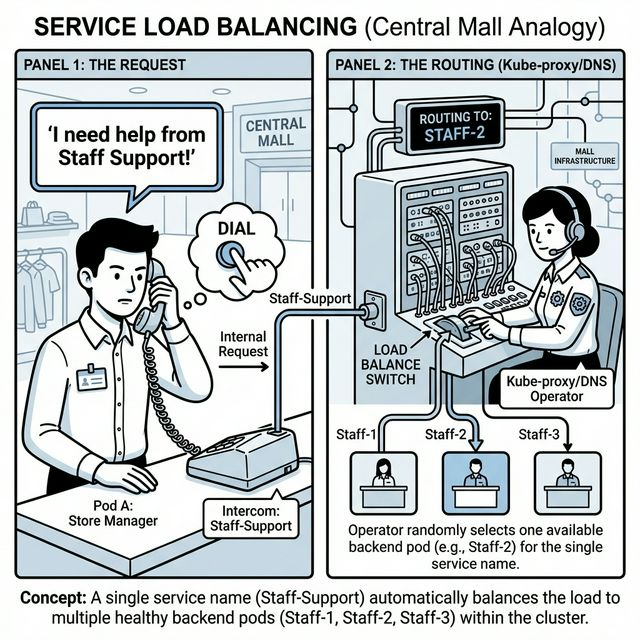

# 🖼️ Comic: The Internal Intercom
## Chapter 11: Services – ClusterIP

This comic explains how **ClusterIP** (Internal Services) works in Kubernetes using the Central Mall's intercom analogy.

---

## 🛍️ Mall Analogy

- **Staff-Support (Service Name)** → The stable number everyone in the mall dials when they need help.
- **Switchboard Operator (Kube-proxy/DNS)** → When you dial "Staff-Support", the operator looks at their board, sees who is available, and connects you.
- **The Workers (Endpoints)** → Staff-1, Staff-2, and Staff-3. They come and go, but the number you dial (Staff-Support) never changes.
- **Load Balancing** → The operator doesn't send every call to Staff-1; they spread the work across everyone who is currently answering their phone.

> 🛍️ *Don't dial a person; dial a role. Kubernetes connects you to whoever is free.*

---

## 🧠 Key Takeaways

- **Internal Only:** ClusterIP is the default service type. It is only accessible from *inside* the cluster (like an internal intercom).
- **Service Discovery:** Pods can find each other using the Service Name (e.g., `db-service`) instead of tracking changing IP addresses.
- **Stable IP:** The Service gets a stable "Virtual IP" that stays the same for the life of the Service object.
- **CKAD Tip:** Practice using `kubectl expose` to quickly create a ClusterIP service and use `nslookup` inside a Pod to verify it can resolve the service name.

---

## 🔗 References
- **Study Guide** → [Chapter 11: Services & Networking](../../../../sources/study-guide/ch11-services.md)
- **Lab** → [Lab 01 - ClusterIP Internal Traffic](../../../../practice/labs/ch11-services/lab01-clusterip-internal-traffic/README.md)
- **Docs** → [Service IP Tracker Evolution](../../../../reference/md-resources/service-ip-tracker-evolution.md)

---
[Mall Directory ✨](../../../../GLOSSARY.md)
