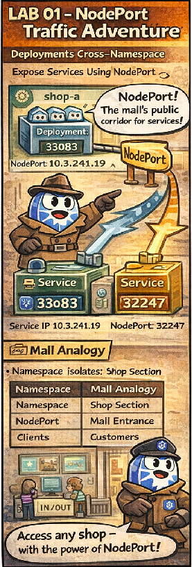

# 🕵️ The NodePort Traffic Adventure

This comic explains:

- how **NodePort** exposes services externally
- why namespaces do **not** block network traffic
- how traffic reaches Pods across namespaces

📌 Read this if:
- you are doing **LAB 01**
- NodePort feels “magical”
- you want a clean CKAD mental model

---

## 🛍️ Mall Analogy

- Node → Mall building
- NodePort → Side entrance with a fixed door number
- Namespace → Floor inside the mall
- Pod → Shop

Traffic doesn’t care about floors, only doors.

---

## 🧠 Key Takeaways

- NodePort listens on **every node**
- Namespaces are logical, not network barriers
- Traffic is routed by Services, not namespaces

---

## 🔗 References
- Chapter → [Chapter 11: Networking Services](../../../sources/study-guide/ch11-services.md)
- Lab → [LAB 02 – NodePort Cross Namespace](../../../../practice/labs/ch11-services/lab02-nodeport-cross-namespace/README.md)
