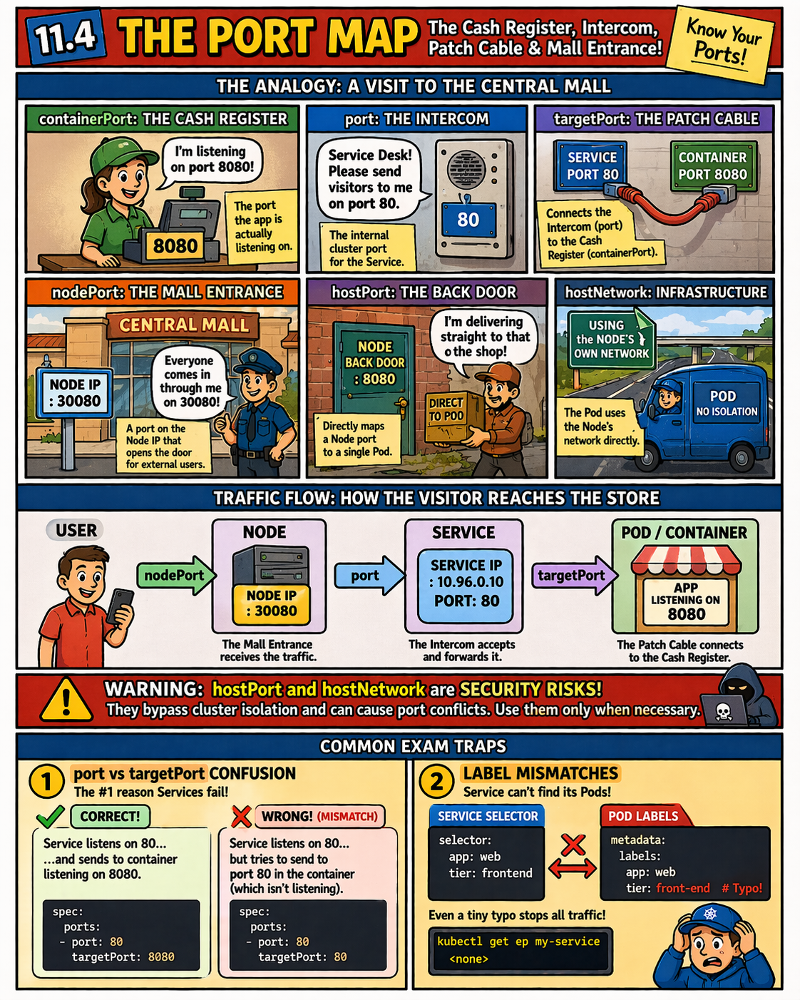

# 🎨 Section 11.4: The Port Map

*The Cash Register, Intercom, Patch Cable & Mall Entrance!*

---

### 📖 The Port Analogy Reference

| Port Name | Mall Analogy | Role |
| :--- | :--- | :--- |
| **`containerPort`** | **The Cash Register** | The port the app is actually listening on. |
| **`port`** | **The Intercom** | The internal cluster port for the Service. |
| **`targetPort`** | **The Patch Cable** | Connects the Intercom to the Register. |
| **`nodePort`** | **The Mall Entrance** | A port on the Node IP for external users. |
| **`hostPort`** | **The Back Door** | Maps a Node port directly to a single Pod. |
| **`hostNetwork`** | **Infrastructure** | Pod uses the Node's own network directly. |

---
## 🔗 References
- **Study Guide** → [Chapter 11: Services & Networking](../../../../sources/study-guide/ch11-services.md)
