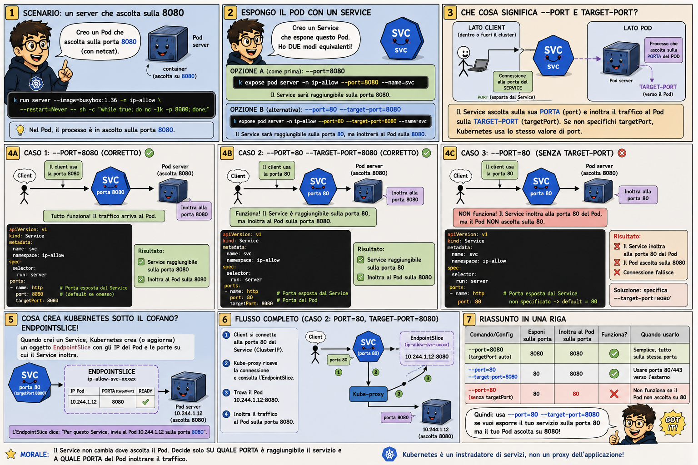

# 🎨 The Scaling Ledger (Endpoints vs EndpointSlice)

## The Evolution of the Guest List

In the **Central Mall**, managing a massive team of shop workers requires an efficient system. As the mall grows, the "Management Office" (API Server) needs a way to tell the "Security Guards" (kube-proxy/Nodes) which workers are ready to help.

---

### 🧱 The Old Way: The Massive Scroll (Endpoints)
Imagine a single, giant piece of paper listing every single worker's phone number. 
*   **The Problem:** Every time *one* worker joins or leaves, the office has to rewrite the **entire** scroll and hand a copy to every single guard in the mall. 
*   **The Result:** A massive bottleneck. The office is busy re-printing paper instead of managing the mall!

### 📦 The Modern Way: Organized Slices (EndpointSlice)
The office upgraded to a digital system that breaks the list into smaller "Slices."
*   **The Benefit:** If one worker leaves, the office only updates **one small slice**.
*   **The Result:** Fast, efficient, and scalable. The mall can grow to thousands of workers without slowing down the guards.

---

*Figure 1: How EndpointSlices partition large sets of endpoints to reduce API pressure.*

---

## 🔬 Technical Spotlight
*   **Endpoints:** The legacy resource. Monolithic and limited in scale.
*   **EndpointSlice:** The modern resource. Partitioned, scalable, and allows for more metadata (like topology hints).

---
[Back to Chapter 11 Comics](../README.md) | [Mall Directory ✨](../../../../GLOSSARY.md)
