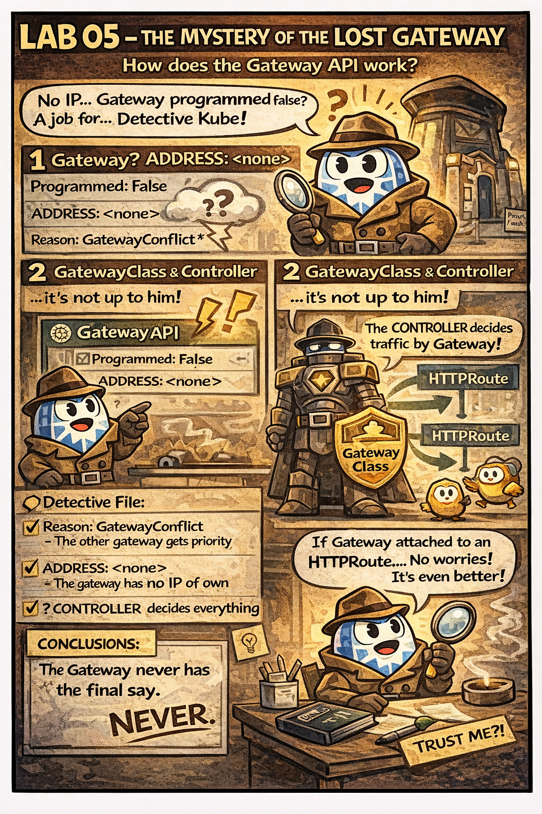

# 🕵️ The Mystery of the Lost Gateway

This comic explains:

- why a Gateway may show `Programmed: False`
- what **GatewayConflict** really means
- why a Gateway **does not have its own IP**
- who actually controls traffic (GatewayClass / Controller)

📌 Read this if:
- you are working on **[LAB 05](../../../../practice/labs/ch12-ingress/lab05-canary-deployment-gateway-api/README.md)**.
- you see `ADDRESS: <none>` and think something is broken
- you are under CKAD exam pressure 😄

🔗 References:
- Docs → [gateway-api.md](../../../../reference/md-resources/gateway-api.md)
- Lab → [LAB 05 – Canary Deployments](../../../../practice/labs/ch12-ingress/lab05-canary-deployment-gateway-api/README.md)
---

## 🔗 References
- Chapter → [Chapter 12: Ingress & Gateway API](../../../sources/study-guide/ch12-ingress.md)
