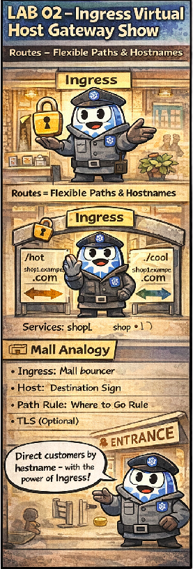

# 🕵️ The Virtual Host Gateway Show

This comic explains:

- host-based routing with **Ingress**
- how one IP serves multiple applications
- how traffic is routed before hitting Services

📌 Read this if:
- you are doing **LAB 03**
- you mix up Service vs Ingress responsibilities
- you want routing clarity for CKAD

---

## 🛍️ Mall Analogy

- Ingress → Reception desk
- Host header → “Which shop are you looking for?”
- Service → Internal directory

---

## 🧠 Key Takeaways

- Ingress routes by **host/path**
- Services don’t inspect HTTP
- Ingress sits *before* Services

---

## 🔗 References
- Chapter → [Chapter 12: Ingress & Gateway API](../../../sources/study-guide/ch12-ingress.md)
- Lab → [LAB 03 – Ingress Virtual Host](../../../../practice/labs/ch12-ingress/lab03-ingress-virtual-host/README.md)
