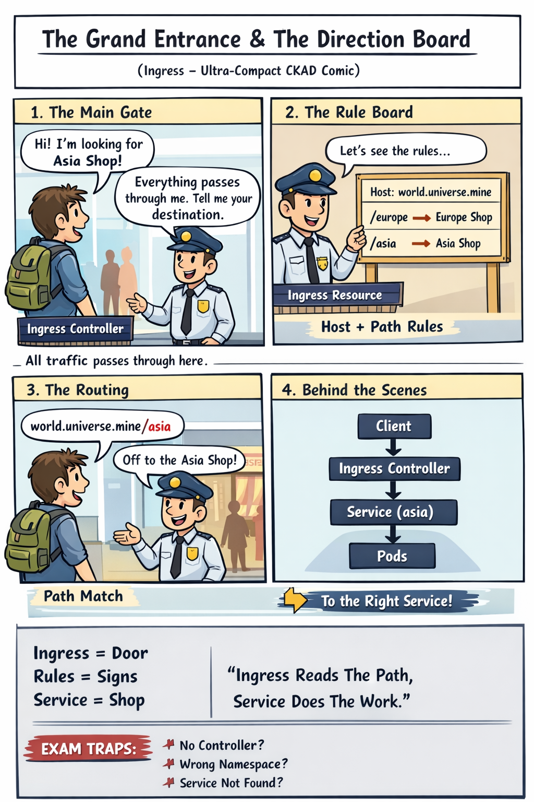

# 🖼️ Comic: The Grand Entrance & The Direction Board
## Chapter 12: Ingress – Path-Based Routing

---

*The Mall's main gateway doesn't just open the door; it checks your "Path" to ensure you reach the right wing.*

---

### 🎬 Panel 1 – The Main Gate
**Customer:** "Hi! I'm looking for Asia Shop!"
**Guard (Ingress Controller):** "Everything passes through me. Tell me your destination."
> **Architecture Insight:** All external traffic hits the Ingress Controller first. It acts as the single point of entry for the entire Mall.

### 🎬 Panel 2 – The Rule Board
**Guard reads a table (The Ingress Resource):**
- **Host:** `world.universe.mine`
- **Path /europe** → Europe Shop (Service)
- **Path /asia** → Asia Shop (Service)
> **Architecture Insight:** The Ingress Resource is just a "Direction Board" (YAML) that tells the Guard how to route different requests.

### 🎬 Panel 3 – The Routing
**Customer:** "I'm at world.universe.mine/asia"
**Guard:** "Perfect, follow the signs to the Asia Shop!"
> **Architecture Insight:** Routing happens via path matching. The Guard doesn't need to know the shop's secret back door; he just points the way.

### 🎬 Panel 4 – Behind the Scenes
`Client` → `Ingress Controller` → `Service (Asia)` → `Pods`
> **Architecture Insight:** Ingress NEVER talks to Pods directly. It passes the customer to the internal Intercom (Service), which then finds the available Staff (Pods).

---

## 🧠 Key Takeaways
- **Path-Based Routing:** One domain, multiple sub-paths.
- **Service Dependency:** Ingress maps paths to Services, not Pods.
- **The Guard:** The Ingress Controller (Nginx, Gateway API, etc.) is the active component that enforces the rules.

---
[<< Previous: Virtual Host Routing](../01-virtual-host/README.md) | [Back to Comics Index](../../README.md)

---
[Mall Directory ✨](../../../../GLOSSARY.md) | [🔙 Back](javascript:history.back())
