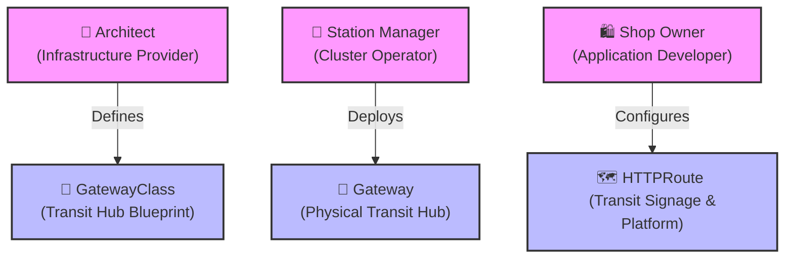

# 🖼️ Comic: The Smart Transit Hub (Gateway API Routing)
## Chapter 12: Ingress vs. Gateway API – Advanced Routing

This comic explains the modern **Kubernetes Gateway API** using the analogy of a busy city transit hub serving the Central Mall.

---

## 🛍️ The Transit Hub Analogy

Imagine a high-speed train station (Transit Hub) constructed at the entrance of the Central Mall to handle customer arrivals. The Gateway API splits this setup into three distinct roles:

### 1. 📐 The Architect's Blueprint (`GatewayClass`)
* **Role:** *Infrastructure Provider* (e.g., Cloud Platform / Cluster Admin).
* **The Analogy:** The architectural standard and blueprints for how any transit hub must be built in the city (e.g., standard layout, safety features, track gauge).
* **K8s Concept:** Defines the underlying controller class (e.g., GKE Ingress, Envoy Gateway, Istio).

### 2. 👷 The Station Manager (`Gateway`)
* **Role:** *Cluster Operator* (e.g., Operations / Platform Team).
* **The Analogy:** The actual, physical train station built at the mall entrance. It has a specific physical address (External IP) and listens for incoming trains on specific tracks (Ports).
* **K8s Concept:** Allocates the actual load balancer IP and opens ports (e.g., Port 80 for HTTP).

### 3. 🛍️ The Shop Owners (`HTTPRoute`)
* **Role:** *Application Developer* (e.g., Developer Teams).
* **The Analogy:** The signage inside the station. Shop owners don't control the train station; they just install signs pointing travelers to their shops (e.g., *"Take platform 1 for the Shoe Store"* or *"/food"* $\rightarrow$ *Food Court*).
* **K8s Concept:** Routes traffic from the Gateway's IP to individual backend Services based on HTTP paths or hostname headers.

---

## 🧠 Key Takeaways

1. **Role Separation:** 
   In legacy Ingress, the app developer had to manage ingress controller configurations, hostname bindings, and SSL certificates in a single object. Gateway API splits these responsibilities so that developers can configure `HTTPRoutes` without touching the cluster-wide IP configurations (`Gateway`).
2. **Path & Host Routing:** 
   An `HTTPRoute` can route traffic based on:
   * **Hostnames:** `shoes.mall.com` vs `clothes.mall.com`.
   * **URL Paths:** `/shoes` vs `/clothes`.
3. **Multi-Parent Attachment:** 
   An `HTTPRoute` can attach to multiple `Gateways` (e.g., an internal gateway and a public internet gateway) simply by referencing them in the `parentRefs` field.

---

## 🔗 References
* **Study Guide** → [Chapter 12: Ingress & Gateway API](../../../../sources/study-guide/ch12-ingress.md)
* **Lab** → [Lab 05 - Gateway API Routing](../../../../practice/labs/ch12-ingress/lab05-gateway-api-routing/README.md)
* **Docs** → [Understanding Gateway API](../../../../reference/md-resources/gateway-api.md)

---

> **Disclaimer:** *Kubernetes®, CKAD, and CNCF are registered trademarks of The Linux Foundation. This project is an independent educational resource and is not affiliated with, sponsored by, or officially endorsed by The Linux Foundation or the Cloud Native Computing Foundation (CNCF).*
