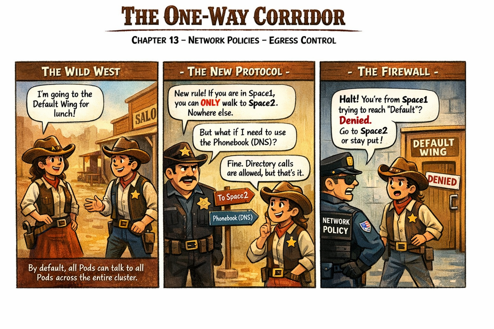

# 🖼️ Comic: The One-Way Corridor

## Chapter 13: Network Policies – Egress Control

---

### 🎬 Panel 1 – The Wild West
**Worker A (Space1):** "I'm going to the Default Wing for lunch!"
**Worker B (Space2):** "I'm calling Space1 to check inventory!"
> [!NOTE]
> By default, all Pods can talk to all Pods (Non-isolated) across the entire cluster.

### 🎬 Panel 2 – The New Protocol
**Manager:** "New rule! If you are in Space1, you can ONLY walk to Space2. Nowhere else."
**Worker A:** "But what if I need to use the Phonebook (DNS)?"
**Manager:** "Fine. Directory calls are allowed, but that's it."

### 🎬 Panel 3 – The Firewall
**Security Guard (NetworkPolicy):** "Halt! You're from Space1 trying to reach 'Default'? Denied. Go to Space2 or stay put."

---

## 💡 Concept: Egress Isolation
In the **Central Mall**, an **Egress Rule** is like a specialized exit pass.
- **Default Behavior:** All exits are open. Workers can wander anywhere.
- **Isolation Applied:** The moment an Egress policy touches a pod, **all exits are locked** except those explicitly whitelisted.
- **The DNS Exception:** To find other shops by name, workers MUST be allowed to reach the Mall's Phonebook (DNS on Port 53).

---

## 🧪 Hands-on Practice
Learn how to build these one-way corridors in the lab:
- 🧪 **Lab 02:** [One-Way Corridors (Egress Control)](../../../../practice/labs/ch13-networking/lab02-network-policies/README.md)

---

## 🔗 References
- **Study Guide** → [Chapter 13: Networking](../../../../sources/study-guide/ch13-networking.md)
