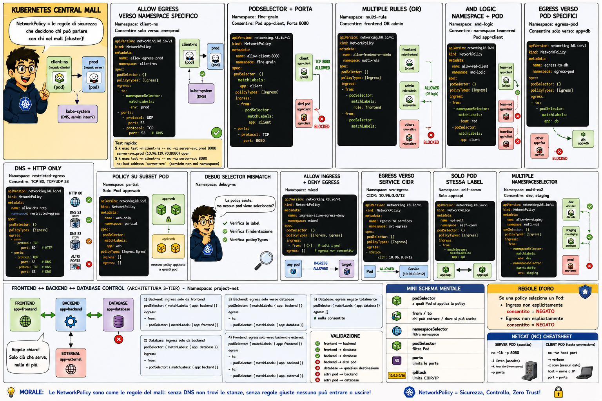

# 🎨 Section 13.3: Network Policy Master Map

*The Grand Security Blueprint of the Central Mall!*

---

### 📖 The Master Security Guide

In the **Central Mall**, security is managed by strict rules that decide who can enter which corridor and who can talk to whom. This map provides a complete overview of every security pattern you might encounter.

| Pattern (Italian) | Translation / Meaning | Mall Analogy |
| :--- | :--- | :--- |
| **Allow Egress verso Namespace Specifico** | Allow Outgoing to Specific Namespace | Allowing a shop to call a warehouse in another wing of the mall. |
| **PodSelector + Porta** | Pod Selector + Port | Letting a customer reach a specific counter (port) in a specific shop. |
| **Multiple Rules (OR)** | Multiple Rules (OR) | "If you have a VIP badge OR a Staff badge, you can enter." |
| **AND Logic (Namespace + Pod)** | AND Logic (Namespace + Pod) | "You must be in the Tech Wing AND have a Manager badge to enter." |
| **Egress verso Pod Specifici** | Egress to Specific Pods | Allowing a clerk to only talk to the specific database worker they need. |
| **DNS + HTTP Only** | DNS + HTTP Only | Restricting communication to only the phonebook and the standard web counter. |
| **Allow Ingress + Deny Egress** | Allow Ingress + Deny Egress | "Customers can come in, but the staff cannot leave the shop." |
| **Egress verso Service CIDR** | Egress to Service Range | Allowing traffic to a whole block of external mall services. |

---

## 🧠 Golden Rules of the Mall (Regole d'Oro)

1. **If a policy selects a Pod:**
   - Ingress not explicitly allowed = **DENIED (NEGATO)**
   - Egress not explicitly allowed = **DENIED (NEGATO)**

2. **The "Intercom" (DNS) Trap:**
   - If you allow egress to a namespace but forget to allow port `53`, your shop won't be able to "find the address" of its neighbor, even if the door is open!

---

## 🛠️ Netcat (nc) Cheatsheet
Use these tools to test if the "Intercom" and "Doors" are working:

- `nc -lk -p 8080`: Open a counter to listen (Server).
- `nc -vz <host> <port>`: Test if a specific door is open (Client).
- `-v`: Verbose (tell me more).
- `-z`: Zero-I/O (just test the connection, don't send data).

---
[Mall Directory ✨](../../../../GLOSSARY.md) | [Back to Networking Index](../README.md)
