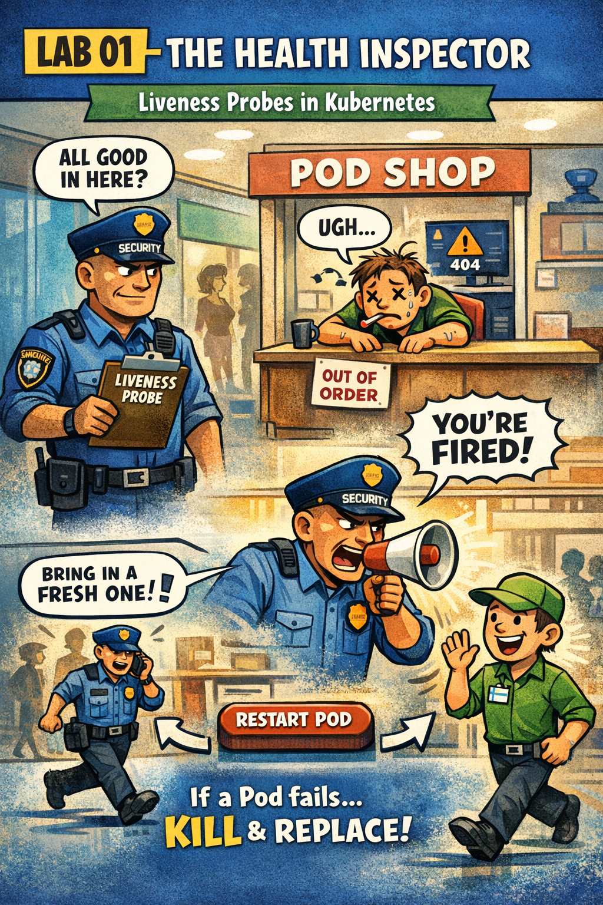

# 🖼️ Comic: The Health Inspector
## Chapter 14: Probes – Liveness Checks

This comic explains the difference between **Liveness** and **Readiness** probes using the "Health Inspector" analogy.

---

## 🛍️ Mall Analogy

- **The Health Inspector (Liveness Probe)** → A supervisor who periodically walks around to make sure the workers aren't asleep or unresponsive.
- **The Faint (Crash/Lockup)** → A worker who is still in the building but can't answer the inspector's questions.
- **The Restart** → If the inspector sees a worker has "fainted," they immediately replace them with a fresh, alert worker (Restarting the Pod).
- **initialDelaySeconds** → Giving a new hire 5 minutes to get their coffee and get settled before the inspector starts breathing down their neck.

> 🛍️ *If they aren't answering, they aren't working. Swap them out!*

---

## 🧠 Key Takeaways

- **Self-Healing:** Liveness probes are the primary mechanism for Kubernetes to automatically recover from application deadlocks or infinite loops.
- **Restart Policy:** When a liveness probe fails, Kubernetes kills the container and creates a new one (as long as the `restartPolicy` allows it).
- **Probes Types:** You can check via **HTTP** (a web request), **TCP** (a socket connection), or an **Exec** command (running a script inside).
- **CKAD Tip:** Don't set the liveness probe to check a 3rd-party dependency (like a database). If the DB is down, it shouldn't kill your web server Pod!

---

## 🔗 References
- **Study Guide** → [Chapter 14: Health Checks & Probes](../../../../sources/study-guide/ch14-probes.md)
- **Lab** → [Lab 01 - Liveness Probes](../../../../practice/labs/ch14-probes/lab01-liveness-probes-health-inspector/README.md)
- **Docs** → [Troubleshooting Guide](../../../../reference/md-resources/troubleshooting-kubernetes.md)

---
[Mall Directory ✨](../../../../GLOSSARY.md) | [🔙 Back](javascript:history.back())
